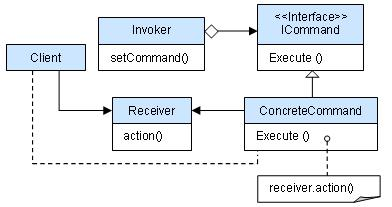
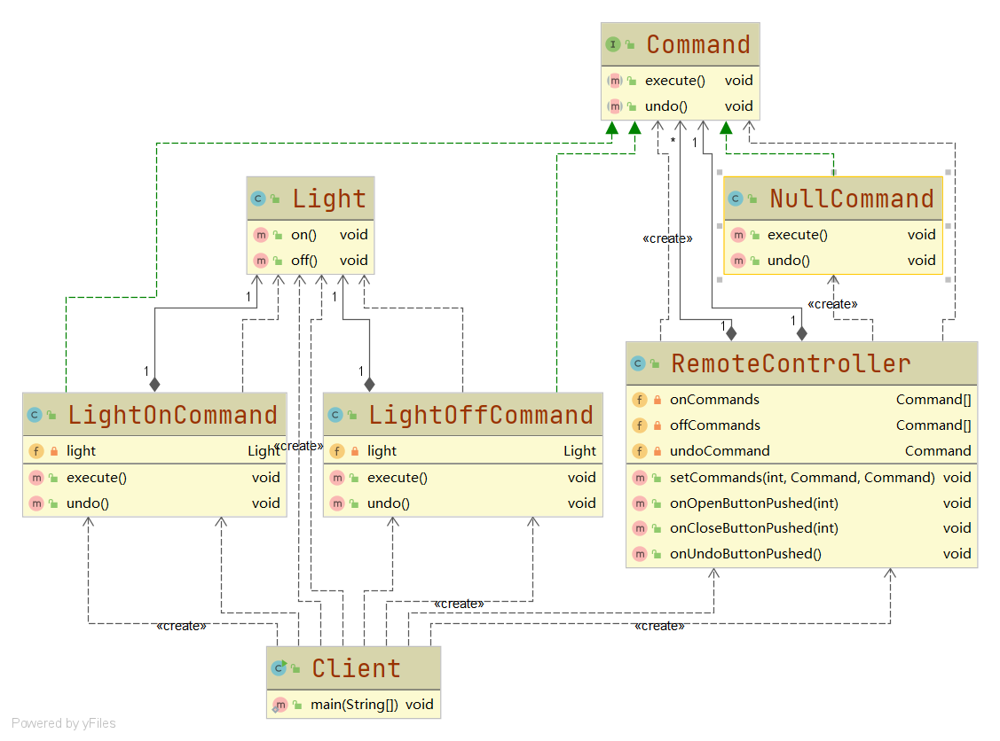
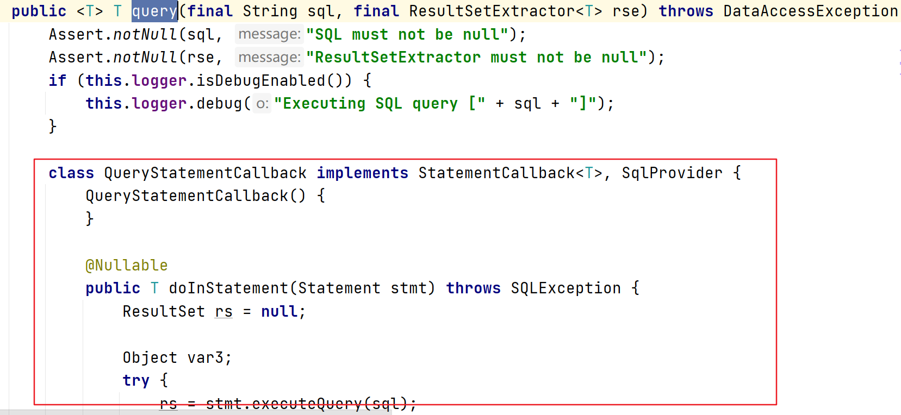
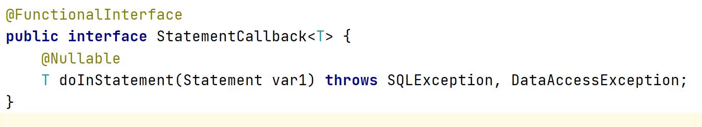
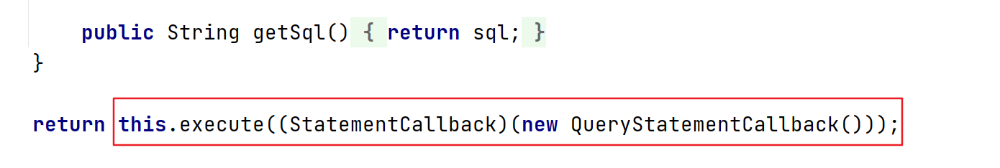
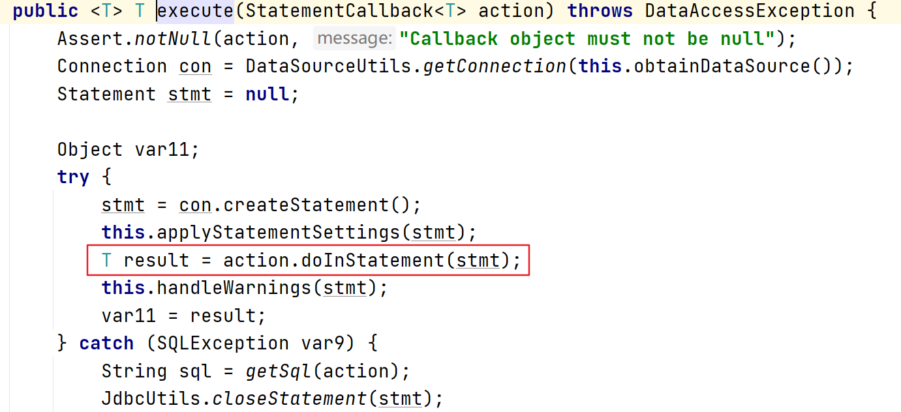

# 命令模式

#### 定义

>将请求以命令的形式封装成对象，并传给调用对象，调用对象寻找可以处理该命令的合适的对象，该对象执行命令。

#### 原理

###### 原理类图



###### 说明

* ###### Invoker是调用者，聚合了抽象的命令

* ###### ICommand是抽象的命令，可以是接口或者抽象类

* ###### Receiver是接收者，知道如何处理命令，一般聚合在具体的命令中

* ###### 具体的命令，会与接收者对象绑定，调用接收者相应的操作

#### 应用场景

>模拟命令行、订单的撤销/恢复、触发-反馈机制等

#### 例子

>我们购买了一套智能家电，有照明灯、风扇、冰箱和洗衣机等。本来只需要在手机上安装相应的App就可以实现控制这些家电，但是家电有太多了，我们希望只用一个遥控器就能控制所有的家电。

>请问用命令模式如何实现该系统？

#### 实现

###### UML类图



###### [代码](../../../../../src/main/java/org/fade/pattern/bp/command)

* ###### 抽象命令

```java
public interface Command {

    void execute();

    void undo();

}
```

* ###### 开灯命令

```java
public class LightOnCommand implements Command{

    private Light light;

    public LightOnCommand(Light light){
        this.light = light;
    }

    @Override
    public void execute() {
        this.light.on();
    }

    @Override
    public void undo() {
        this.light.off();
    }

}
```

* ###### 关灯命令

```java
public class LightOffCommand implements Command {

    private Light light;

    public LightOffCommand(Light light){
        this.light = light;
    }

    @Override
    public void execute() {
        this.light.off();
    }

    @Override
    public void undo() {
        this.light.on();
    }

}
```

* ###### 空命令

```java
public class NullCommand implements Command{


    @Override
    public void execute() {

    }

    @Override
    public void undo() {

    }

}
```

>空命令用来简化操作，可以省去对空的判断

* ###### 灯

```java
public class Light {

    public void on(){
        System.out.println("打开了灯......");
    }

    public void off(){
        System.out.println("关掉了灯......");
    }

}
```

* ###### 遥控器

```java
public class RemoteController {

    private Command[] onCommands;

    private Command[] offCommands;

    private Command undoCommand;

    public RemoteController(){
        this.onCommands = new Command[5];
        this.offCommands = new Command[5];
        for (int i = 0;i<5;i++){
            this.onCommands[i] = new NullCommand();
            this.offCommands[i] = new NullCommand();
        }
    }

    public void setCommands(int no,Command onCommand,Command offCommand){
        this.onCommands[no] = onCommand;
        this.offCommands[no] = offCommand;
    }

    public void onOpenButtonPushed(int no){
        this.onCommands[no].execute();
        this.undoCommand = this.onCommands[no];
    }

    public void onCloseButtonPushed(int no){
        this.offCommands[no].execute();
        this.undoCommand = this.offCommands[no];
    }

    public void onUndoButtonPushed(){
        this.undoCommand.undo();
    }

}
```

* ###### 客户端

```java
public class Client {

    public static void main(String[] args) {
        Light light = new Light();
        LightOnCommand lightOnCommand = new LightOnCommand(light);
        LightOffCommand lightOffCommand = new LightOffCommand(light);
        RemoteController remoteController = new RemoteController();
        remoteController.setCommands(0,lightOnCommand,lightOffCommand);
        System.out.println("----------按下遥控器上打开灯的开关----------");
        remoteController.onOpenButtonPushed(0);
        System.out.println("----------按下遥控器上关闭灯的开关----------");
        remoteController.onCloseButtonPushed(0);
        System.out.println("----------按下遥控器上的撤销开关----------");
        remoteController.onUndoButtonPushed();
    }

}
```

###### 运行结果

```
----------按下遥控器上打开灯的开关----------
打开了灯......
----------按下遥控器上关闭灯的开关----------
关掉了灯......
----------按下遥控器上的撤销开关----------
打开了灯......
```

#### 在Spring框架中的应用实例

>在Spring JDBC中的JdbcTemplate类中有一个query()方法



>query()方法里定义了一个内部类，如上图红框所示。

>可以看到这个内部类实现了StatementCallback接口：



>这里的StatementCallback就相当于抽象命令，而内部类QueryStatementCallback就相当于具体的命令，而QueryStatementCallback也对doInStatement()方法进行了实现，处理了命令，只不过它没有用单独的类去完成，所以它也是接收者。

>JdbcTemplate中还有一个execute()方法，它在query()方法中被调用了



>而对query()方法进行查看，发现它有这么一段代码：



>这里execute()方法调用了StatementCallback的doInStatement()方法，相当于调用者

#### 优缺点

* ###### 将发起请求的对象与执行请求的对象解耦，降低了耦合性

* ###### 容易设计命令队列，易于多线程执行命令

* ###### 可能导致某些系统有过多的具体命令类，增加了系统的复杂度

* ###### 易于实现对请求的撤销和重做
