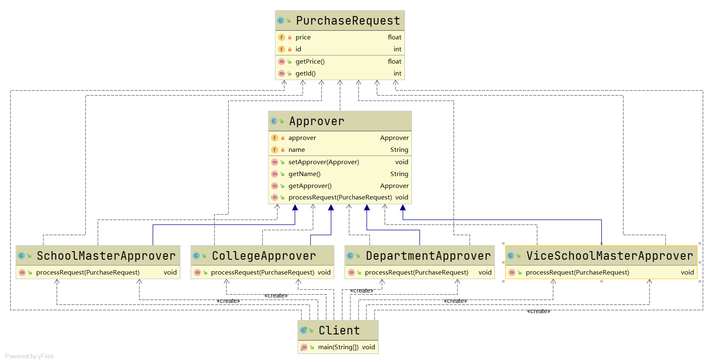
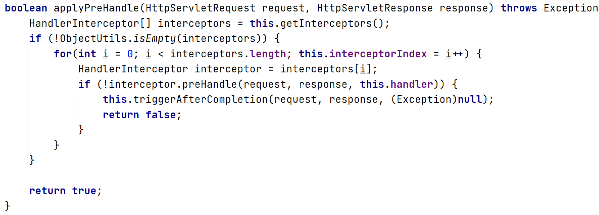

# 职责链模式

#### 定义

>每个接收者都包含对另一个接收者的引用，如何自己无法处理某一请求，则会把该请求传递给下一个接收者。

#### 原理

###### 原理类图


###### 说明

* ###### Handler，抽象的处理者，声明了一个处理请求的接口，同时包含着对其它Handler的引用

* ###### ConcreteHandler，具体的处理者，实现了处理请求的接口，如果可以处理当前请求，则处理；否则将请求交给其它处理者处理

#### 应用场景

>多级请求、请假或者加薪等审批流程

#### 例子

>一学校计划采购一批器材，如果金额小于等于5000，由系主任审批即可；如果金额大于5000且小于等于10000，由院长审批；如果金额大于10000且小于等于30000，由副校长审批；如果金额超过30000，则由校长审批。

#### 传统方式

>传统方式在接收到请求后会根据采购的金额去调用相应的审批者

>但是这样会有个问题：如果审批金额发生了变化，客户端调用的审批者也需要变化

>所以一般采用职责链模式来解决此种问题

#### 改进

###### UML类图



###### [代码](../../../../../src/main/java/org/fade/pattern/bp/cor)

* ###### 抽象审批者

```java
public abstract class Approver {

    private Approver approver;

    private String name;

    public Approver(String name) {
        this.name = name;
    }

    public void setApprover(Approver approver) {
        this.approver = approver;
    }

    public String getName() {
        return name;
    }

    public Approver getApprover() {
        return approver;
    }

    public abstract void processRequest(PurchaseRequest request);

}
```

* ###### 具体审批者

```java
public class DepartmentApprover extends Approver{

    public DepartmentApprover(String name) {
        super(name);
    }

    @Override
    public void processRequest(PurchaseRequest request) {
        if (request.getPrice()<=5000){
            System.out.println("请求编号id="+request.getId()+"被"+this.getName()+"处理了......");
        }
        else {
            this.getApprover().processRequest(request);
        }
    }

}
```

>其它审批者大同小异

* ###### 采购请求

```java
public class PurchaseRequest {

    private float price;

    private int id;

    public PurchaseRequest(float price,int id){
        this.price = price;
        this.id = id;
    }

    public float getPrice() {
        return price;
    }

    public int getId() {
        return id;
    }

}
```

* ###### 客户端

```java
public class Client {

    public static void main(String[] args) {
        DepartmentApprover departmentApprover = new DepartmentApprover("张主任");
        CollegeApprover collegeApprover = new CollegeApprover("李院长");
        ViceSchoolMasterApprover viceSchoolMasterApprover = new ViceSchoolMasterApprover("王副校长");
        SchoolMasterApprover schoolMasterApprover = new SchoolMasterApprover("钱校长");
        departmentApprover.setApprover(collegeApprover);
        collegeApprover.setApprover(viceSchoolMasterApprover);
        viceSchoolMasterApprover.setApprover(schoolMasterApprover);
        schoolMasterApprover.setApprover(departmentApprover);
        PurchaseRequest request = new PurchaseRequest(15000, 1);
        departmentApprover.processRequest(request);
    }

}
```

#### 在SpringMVC框架中的源码分析

>在SpringMVC的处理流程中就有这么一步，HandlerMapping会向DispatcherServlet返回一个HandlerExecutionChain对象，而这个HandlerExecutionChain就使用到了职责链模式

>HandlerExecutionChain中有类似于applyPreHandle这样的方法



>而从图中可以得知SpringMVC会依次去调用拦截器，这就使用到了职责链模式

#### 优缺点

* ###### 实现了解耦，提高了系统的灵活性

* ###### 在链较长时会有性能问题，需控制链中所允许的最大节点数

* ###### 采用了类似递归的方式，以致于调试不方便
