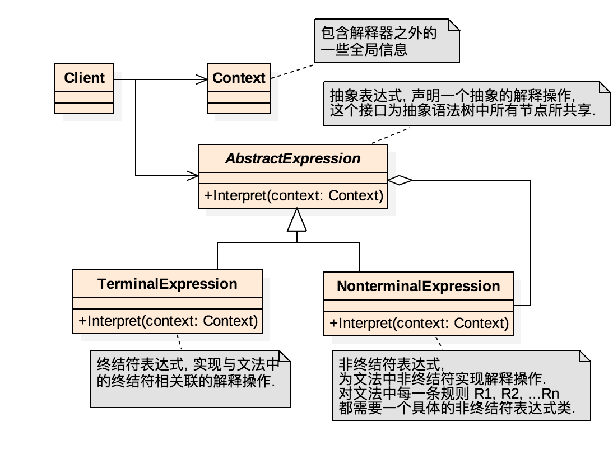
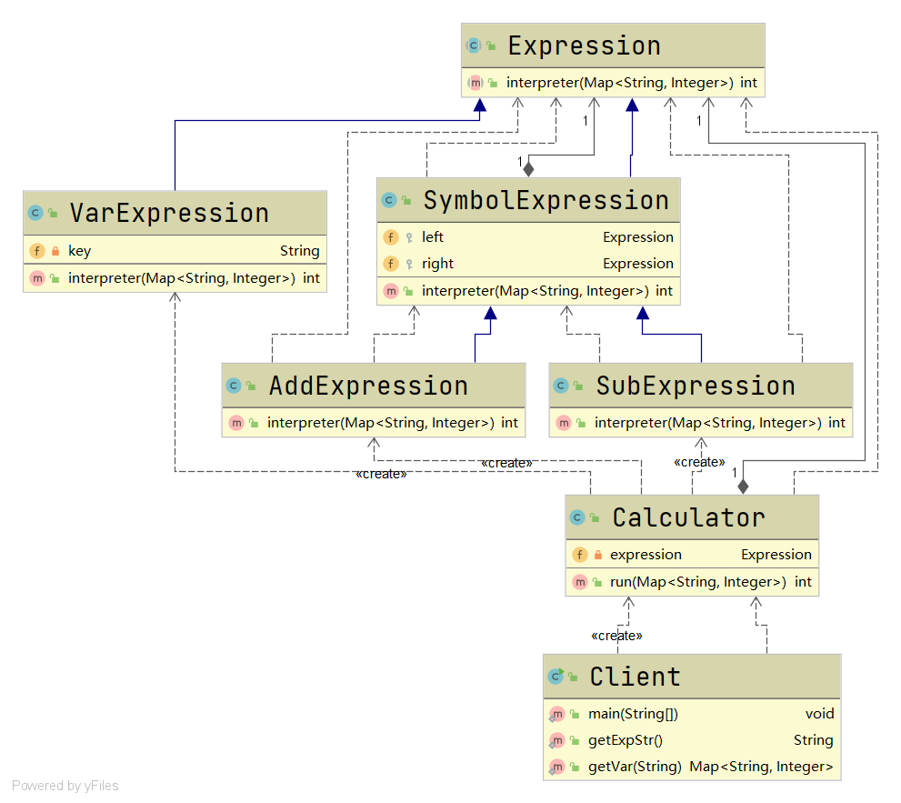
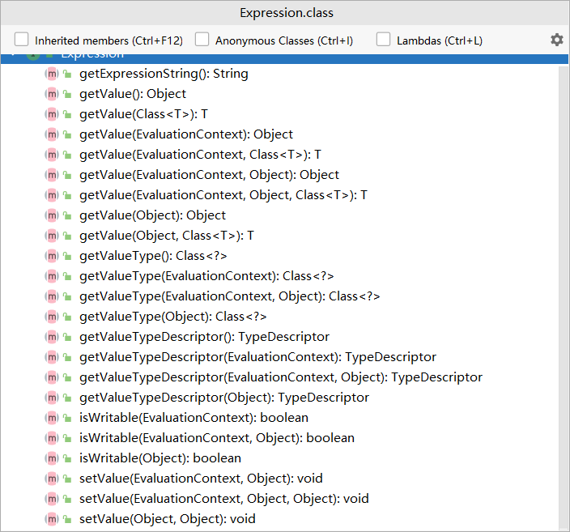
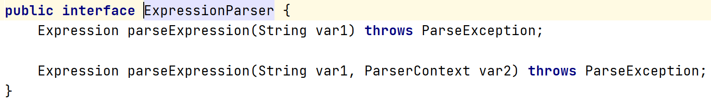
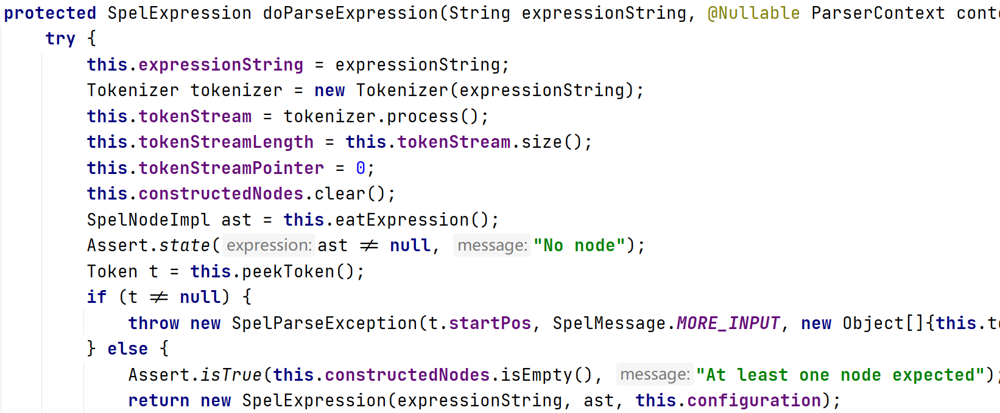

# 解释器模式

#### 定义

>指给定的一个表达式，定义它的文法的表示，并定义一个解释器，使用该解释器来解释语言中的句子。

#### 原理

###### 原理类图



###### 说明

* ###### Context，包含有解释器之外的全局信息

* ###### AbstractExpression，抽象表达式类，定义一个抽象的解释操作，这个方法为抽象语法树中的所有节点所共享

* ###### TerminalExpression，终结符表达式，实现与文法中的终结符相关的解释操作

* ###### NonTerminalExpression，非终结符表达式，为文法中的非终结符实行解释操作

#### 应用场景

>编译器、运算表达式、正则表达式等

#### 例子

>问如何通过解释器模式实现加减运算？

#### 实现

###### UML类图



###### [代码](../../../../../src/main/java/org/fade/pattern/bp/interpreter)

* ###### 抽象表达式类

```java
public abstract class Expression {

    public abstract int interpreter(Map<String,Integer> var);

}
```

* ###### 终结符表达式类

```java
public class VarExpression extends Expression {

    private String key;

    @Override
    public int interpreter(Map<String, Integer> var) {
        return var.get(this.key);
    }

    public VarExpression(String key){
        this.key = key;
    }

}
```

* ###### 非终结符表达式类

```java
public class SymbolExpression extends Expression {

    protected Expression left;

    protected Expression right;

    public SymbolExpression(Expression left,Expression right){
        this.left = left;
        this.right = right;
    }

    @Override
    public int interpreter(Map<String, Integer> var) {
        return 0;
    }

}
```

```java
public class AddExpression extends SymbolExpression {

    public AddExpression(Expression left,Expression right){
        super(left,right);
    }

    @Override
    public int interpreter(Map<String, Integer> var) {
        return super.left.interpreter(var)+super.right.interpreter(var);
    }
}
```

```java
public class SubExpression extends SymbolExpression {

    public SubExpression(Expression left,Expression right){
        super(left, right);
    }

    @Override
    public int interpreter(Map<String, Integer> var) {
        return super.left.interpreter(var)-super.right.interpreter(var);
    }

}
```

* ###### Context类

```java
public class Calculator {

    private Expression expression;

    public Calculator(String expStr){
        Stack<Expression> stack = new Stack<>();
        char[] charArray = expStr.toCharArray();
        Expression left = null;
        Expression right = null;
        for (int i = 0;i<charArray.length;i++){
            switch (charArray[i]){
                case '+':
                    left = stack.pop();
                    right = new VarExpression(String.valueOf(charArray[++i]));
                    stack.push(new AddExpression(left,right));
                    break;
                case '-':
                    left = stack.pop();
                    right = new VarExpression(String.valueOf(charArray[++i]));
                    stack.push(new SubExpression(left,right));
                    break;
                default:
                    stack.push(new VarExpression(String.valueOf(charArray[i])));
                    break;
            }
        }
        this.expression = stack.pop();
    }

    public int run(Map<String,Integer> var){
        return this.expression.interpreter(var);
    }

}
```

* ###### 客户端

```java
public class Client {

    public static void main(String[] args) throws IOException {
        String expStr = getExpStr();
        Map<String,Integer> var = getVar(expStr);
        Calculator calculator = new Calculator(expStr);
        System.out.println("运算结果为："+expStr+" = "+calculator.run(var));
    }

    public static String getExpStr() throws IOException {
        System.out.print("请输入表达式：");
        return (new BufferedReader(new InputStreamReader(System.in))).readLine();
    }

    public static Map<String,Integer> getVar(String expStr){
        Map<String,Integer> var = new HashMap<>();
        for (char ch:expStr.toCharArray()){
            if (ch!='+'&&ch!='-'){
                var.put(ch+"",Integer.valueOf(ch+""));
            }
        }
        return var;
    }

}
```

###### 运行结果

```
请输入表达式：1+2-3+8
运算结果为：1+2-3+8 = 8
```

#### 在Spring框架中的应用实例







#### 优缺点

* ###### 可扩展性比较好，便于解析表达式

* ###### 可能会引起类膨胀

* ###### 采用了递归调用的方法，可能会导致调试复杂和效率降低
