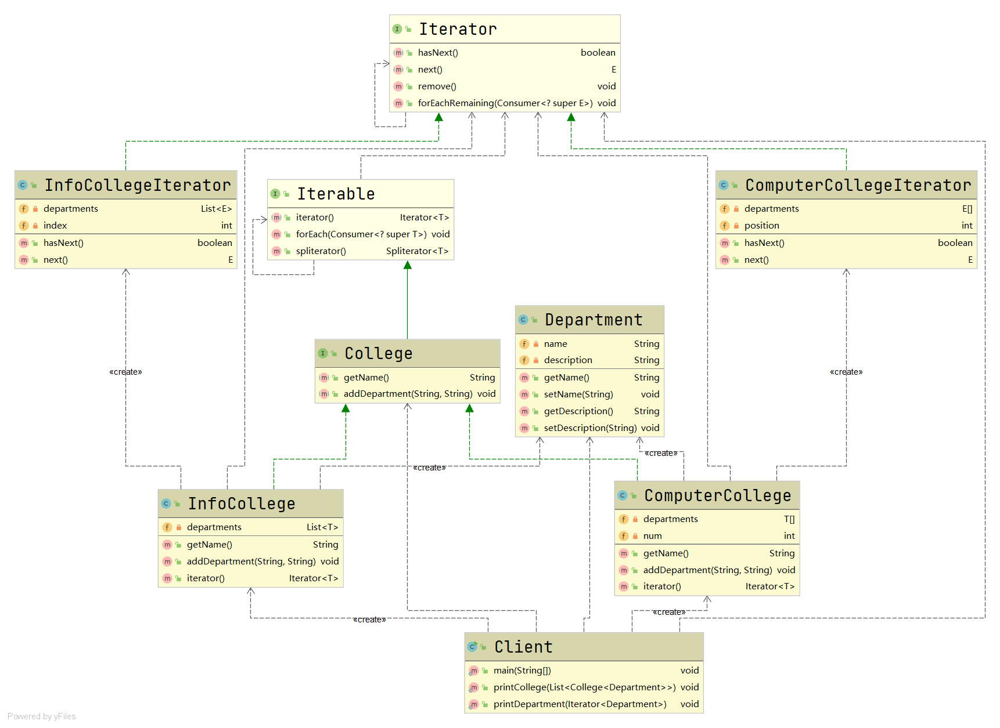
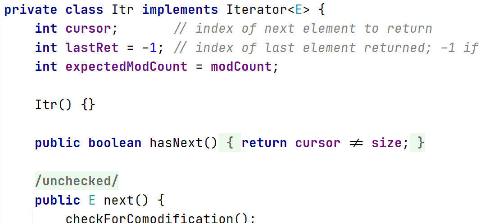
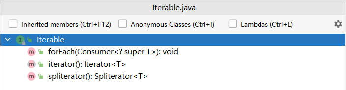
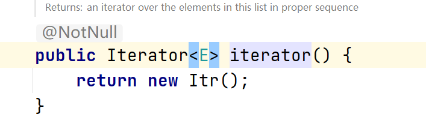
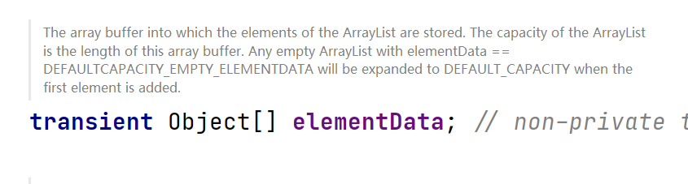

# 迭代器模式

#### 定义

>提供一种方法顺序访问一个聚合对象中的各个元素, 而又无须暴露该对象的内部表示

#### 原理

###### 原理类图


###### 说明

* ###### Iterator接口，声明了遍历集合所需的操作，由JDK提供

* ###### ConcreteIterator类，具体的的迭代器类，实现了遍历集合所需的操作

* ###### IterableCollection接口，聚合接口，声明了获取与集合兼容的迭代器的方法

* ###### ConcreteCollection类，实现了返回迭代器的方法

#### 应用场景

>使用在访问一个聚合对象的内容而无须暴露它的内部表示和需为遍历不同的聚合结构提供一个统一的接口的情形

#### 例子

>[详情参考](../../sp/composite/composite.md#例子)

>但是这里我们的需求是如何实现方便的遍历的操作？

#### 传统方式

>即使采用组合模式设计了系统，但仍然不是很方便进行遍历，因为里面的集合元素可能是用不同的方式实现的，如数组或集合

#### 改进

###### UML类图



###### [代码](../../../../../src/main/java/org/fade/pattern/bp/iterator)

* ###### 学院接口

```java
public interface College<T> extends Iterable<T> {

    String getName();

    void addDepartment(String name,String description);

}
```

* ###### 计算机学院

```java
@SuppressWarnings("all")
public class ComputerCollege<T> implements College<T> {

    private T[] departments;

    private int num;

    public ComputerCollege() {
        this.departments = (T[])new Object[5];
        this.num = 0;
    }

    @Override
    public String getName() {
        return "计算机学院";
    }

    @Override
    public void addDepartment(String name, String description) {
        this.departments[this.num] = (T) new Department(name,description);
        num++;
    }

    /**
     * Returns an iterator over elements of type {@code T}.
     *
     * @return an Iterator.
     */
    @Override
    public Iterator<T> iterator() {
        return new ComputerCollegeIterator<>(departments);
    }

}
```

* ###### 信息工程学院

```java
@SuppressWarnings("all")
public class InfoCollege<T> implements College<T>{

    private List<T> departments;

    public InfoCollege() {
        this.departments = new ArrayList<>();
    }

    @Override
    public String getName() {
        return "信息工程学院";
    }

    @Override
    public void addDepartment(String name, String description) {
        this.departments.add((T)(new Department(name,description)));
    }

    /**
     * Returns an iterator over elements of type {@code T}.
     *
     * @return an Iterator.
     */
    @Override
    public Iterator<T> iterator() {
        return new InfoCollegeIterator<>(departments);
    }

}
```

* ###### 计算机学院的迭代器

```java
public class ComputerCollegeIterator<E> implements Iterator<E> {

    /**
     * 系以数组的形式存放
     * */
    private E[] departments;

    /**
     * 遍历的位置
     * */
    private int position;

    public ComputerCollegeIterator(E[] departments) {
        this.departments = departments;
    }

    /**
     * Returns {@code true} if the iteration has more elements.
     * (In other words, returns {@code true} if {@link #next} would
     * return an element rather than throwing an exception.)
     *
     * @return {@code true} if the iteration has more elements
     */
    @Override
    public boolean hasNext() {
        if(this.position>=this.departments.length||this.departments[this.position]==null){
            return false;
        }
        else{
            return true;
        }
    }
    
    @Override
    public E next() {
        return this.departments[this.position++];
    }

}
```

* ###### 信息工程学院的迭代器

```java
public class InfoCollegeIterator<E> implements Iterator<E> {

    /**
     * 系以集合的形式存放
     * */
    private List<E> departments;

    /**
     * 遍历的位置(索引)
     * */
    private int index;

    public InfoCollegeIterator(List<E> departments) {
        this.index = -1;
        this.departments = departments;
    }

    /**
     * Returns {@code true} if the iteration has more elements.
     * (In other words, returns {@code true} if {@link #next} would
     * return an element rather than throwing an exception.)
     *
     * @return {@code true} if the iteration has more elements
     */
    @Override
    public boolean hasNext() {
        if (this.index>=this.departments.size()-1){
            return false;
        }
        else{
            this.index++;
            return true;
        }
    }
    
    @Override
    public E next() {
        return this.departments.get(index);
    }

}
```

* ###### 系

```java
public class Department {

    private String name;

    private String description;

    public String getName() {
        return name;
    }

    public void setName(String name) {
        this.name = name;
    }

    public String getDescription() {
        return description;
    }

    public void setDescription(String description) {
        this.description = description;
    }

    public Department(String name, String description) {
        this.name = name;
        this.description = description;
    }

}
```

* ###### 客户端

```java
public class Client {

    public static void main(String[] args) {
        List<College<Department>> list = new ArrayList<>();
        College<Department> info = new InfoCollege<>();
        info.addDepartment("电子系","");
        info.addDepartment("自动化系","");
        College<Department> computer = new ComputerCollege<>();
        computer.addDepartment("人工智能系","");
        computer.addDepartment("信息安全系","");
        list.add(info);
        list.add(computer);
        printCollege(list);
    }

    /**
     * 输出学院
     * */
    public static void printCollege(List<College<Department>> list){
        for (College<Department> college : list) {
            System.out.println("============" + college.getName() + "============");
            printDepartment(college.iterator());
        }
    }

    /**
     * 输出系
     * */
    public static void printDepartment(Iterator<Department> iterator){
        while (iterator.hasNext()){
            Department department = iterator.next();
            System.out.println(department.getName());
        }
    }

}
```

###### 运行结果

```
============信息工程学院============
电子系
自动化系
============计算机学院============
人工智能系
信息安全系
```

#### 在JDK中的应用实例

* ###### java.util

>Iterator接口


>而ArrayList类里由Itr类实现了该接口，是具体的迭代器类



>Iterable接口声明了获取与集合兼容的迭代器的方法



>而ArrayList类里实现了Iterable接口



>ArrayList类里的集合元素是以数组的形式实现的



#### 优缺点

* ###### 提供了统一的方法遍历对象，隐藏了聚合的内部结构

* ###### 把管理对象集合和遍历对象集合的责任分开，符合单一职责原则

* ###### 每个聚合对象都要一个迭代器，会造成过多的迭代器以至于不好管理
