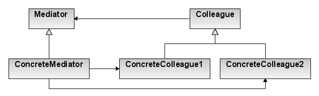
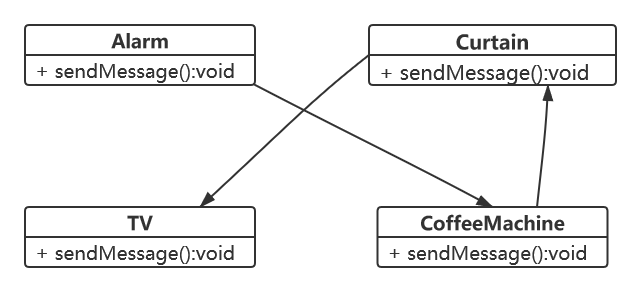
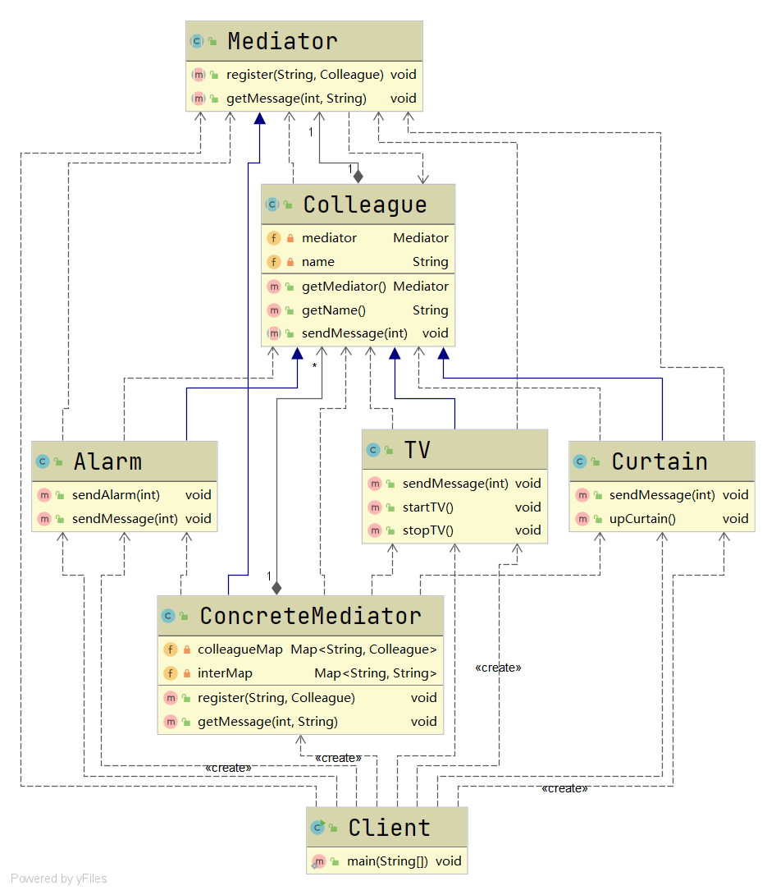

# 中介者模式

#### 定义

>即用一个中介对象来封装一系列的对象交互，从而使得各个对象之间不需要显示地相互引用。

#### 原理

###### 原理类图



###### 说明

* ###### Mediator是抽象的中介者，声明了各个具体同事类对象之间交互的接口

* ###### ConcreteMediator是具体的中介者，实现了Mediator，具体实现了各个具体同事类之间如何交互

* ###### Colleague是抽象同事类，声明了通过Mediator与其它Colleague交互的接口

* ###### ConcreteColleague是具体同事类，实现了通过Mediator和其它Colleague交互的方法

#### 应用场景

>当系统中的对象存在比较复杂的对象引用关系的时候，可以使用中介者模式

#### 例子

>现在一个智能家庭项目，里面有很多智能家具：闹钟、咖啡机、电视机和窗帘等

>问如何编程实现，使得这些智能家具可以协同工作？

#### 传统方式

>假设有一流程：闹铃响起->咖啡机开始工作->窗帘自动升起->电视机开始播放

>采用如下类图的方式设计系统：



>这样当各种家具有多种状态变化时，会使得相互之间的调用关系比较复杂，并且也不利于松耦合。当系统增加一个新的家具时，代码的维护性和扩展性也特别差。

#### 改进

###### UML类图



###### [代码](../../../../../src/main/java/org/fade/pattern/bp/mediator)

* ###### 抽象中介者

```java
public abstract class Mediator {

    public abstract void register(String colleagueName,Colleague colleague);

    public abstract void getMessage(int stateChange,String colleagueName);

}
```

* ###### 具体中介者

```java
public class ConcreteMediator extends Mediator {

    private Map<String,Colleague> colleagueMap;

    private Map<String,String> interMap;

    public ConcreteMediator(){
        colleagueMap = new HashMap<>();
        interMap = new HashMap<>();
    }

    @Override
    public void register(String colleagueName, Colleague colleague) {
        colleagueMap.put(colleagueName,colleague);
        if (colleague instanceof Alarm){
            interMap.put("Alarm",colleagueName);
        }
        else if (colleague instanceof TV){
            interMap.put("TV",colleagueName);
        }
        else if (colleague instanceof Curtain){
            interMap.put("Curtain",colleagueName);
        }
    }

    @Override
    public void getMessage(int stateChange, String colleagueName) {
        if (colleagueMap.get(colleagueName) instanceof Alarm){
            if (stateChange==0){
                ((TV)(colleagueMap.get(interMap.get("TV")))).startTV();
            }
            else if (stateChange==1){
                ((TV)(colleagueMap.get(interMap.get("TV")))).stopTV();
            }
        }
        else if (colleagueMap.get(colleagueName) instanceof TV){
            ((Curtain)(colleagueMap.get(interMap.get("Curtain")))).upCurtain();
        }
    }

}
```

* ###### 抽象同事类

```java
public abstract class Colleague {

    private Mediator mediator;

    private String name;

    public Colleague(Mediator mediator, String name) {
        this.mediator = mediator;
        this.name = name;
    }

    public Mediator getMediator() {
        return mediator;
    }

    public String getName() {
        return name;
    }

    public abstract void sendMessage(int stateChange);

}
```

* ###### 具体同事类

```java
public class Alarm extends Colleague {

    public Alarm(Mediator mediator, String name) {
        super(mediator, name);
        mediator.register(name,this);
    }

    public void sendAlarm(int stateChange){
        this.sendMessage(stateChange);
    }

    @Override
    public void sendMessage(int stateChange) {
        this.getMediator().getMessage(stateChange,this.getName());
    }

}
```

```java
public class Curtain extends Colleague {

    public Curtain(Mediator mediator, String name) {
        super(mediator, name);
        mediator.register(name,this);
    }

    @Override
    public void sendMessage(int stateChange) {
        this.getMediator().getMessage(stateChange,this.getName());
    }

    public void upCurtain(){
        System.out.println("正在升起窗帘!");
    }

}
```

```java
public class TV extends Colleague {

    public TV(Mediator mediator, String name) {
        super(mediator, name);
        mediator.register(name,this);
    }

    @Override
    public void sendMessage(int stateChange) {
        this.getMediator().getMessage(stateChange,this.getName());
    }

    public void startTV(){
        System.out.println("打开电视!");
    }

    public void stopTV(){
        System.out.println("关掉电视!");
    }

}
```

* ###### 客户端

```java
public class Client {

    public static void main(String[] args) {
        Mediator mediator = new ConcreteMediator();
        Alarm alarm = new Alarm(mediator,"alarm");
        Curtain curtain = new Curtain(mediator,"curtain");
        TV tv = new TV(mediator,"TV");
        tv.sendMessage(0);
        alarm.sendMessage(0);
    }

}
```

###### 运行结果

```
正在升起窗帘!
打开电视!
```

#### 优缺点

* ###### 将耦合的网状结构分离成了星型结构，大大降低了耦合度

* ###### 符合迪米特原则

* ###### 中介者承担了较多的责任，一旦中介者出现问题，则会导致整个系统受到影响

* ###### 设计不当将会使中介者变得过于复杂
