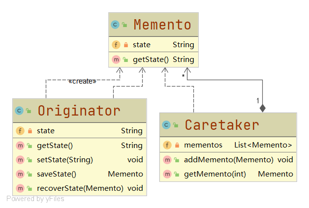
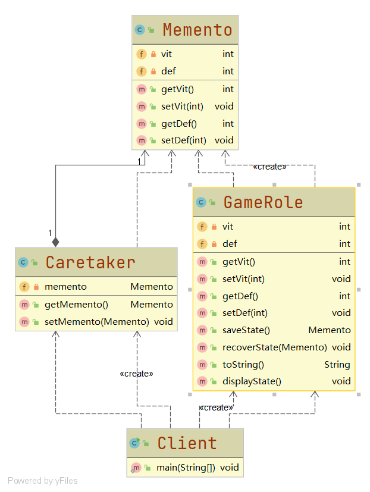

# 备忘录模式

#### 定义

>在不破坏封装性的前提下，捕获一个对象的内部状态，并将这些状态保存在该对象之外，使得在需要时可以恢复到原来的状态。

#### 原理

###### [代码](../../../../../src/main/java/org/fade/pattern/bp/memento/theory)

###### 原理类图



###### 说明

* ###### Memento，备忘录类，可以保存Originator类对象的状态

* ###### Originator，原发器类，有内部的状态，可以生成自身状态的快照，还可以根据快照恢复以前的状态

* ###### Caretaker，守护者类，复杂保存和管理备忘录对象，可以提高效率

#### 应用场景

>需要保存和恢复的场景，需要提供回滚操作的场景等

#### 例子

>假设GTA5中的Mike在做太平洋标准银行差事前，体力和防御力都是5。在进行任务时，游戏角色的所有属性都会被提高1点。但是Mike任务失败了，最后他所有的属性值都变回了原来的值。

>问如何使用备忘录模式实现？

#### 实现

###### UML类图



###### [代码](../../../../../src/main/java/org/fade/pattern/bp/memento/impl)

* ###### 原发器类

```java
public class GameRole {

    private int vit;

    private int def;

    public GameRole(int vit, int def) {
        this.vit = vit;
        this.def = def;
    }

    public GameRole() {
    }

    public int getVit() {
        return vit;
    }

    public void setVit(int vit) {
        this.vit = vit;
    }

    public int getDef() {
        return def;
    }

    public void setDef(int def) {
        this.def = def;
    }

    public Memento saveState(){
        return new Memento(this.vit,this.def);
    }

    public void recoverState(Memento memento){
        this.vit = memento.getVit();
        this.def = memento.getDef();
    }

    @Override
    public String toString() {
        return "GameRole{" +
                "vit=" + vit +
                ", def=" + def +
                '}';
    }

    public void displayState(){
        System.out.println(this.toString());
    }

}
```

* ###### 备忘录类

```java
public class Memento {

    /**
     * 体力
     * */
    private int vit;

    /**
     * 防御力
     * */
    private int def;

    public Memento(int vit,int def){
        this.vit = vit;
        this.def = def;
    }

    public int getVit() {
        return vit;
    }

    public void setVit(int vit) {
        this.vit = vit;
    }

    public int getDef() {
        return def;
    }

    public void setDef(int def) {
        this.def = def;
    }

}
```

* ###### 负责人类

```java
public class Caretaker {

    private Memento memento;

    public Memento getMemento() {
        return memento;
    }

    public void setMemento(Memento memento) {
        this.memento = memento;
    }

}
```

* ###### 客户端

```java
public class Client {

    public static void main(String[] args) {
        GameRole Mike = new GameRole(5,5);
        System.out.print("Mike的初始状态为：");
        Mike.displayState();
        System.out.println("-----------即将开始太平洋标准银行差事-----------");
        Caretaker caretaker = new Caretaker();
        caretaker.setMemento(Mike.saveState());
        System.out.println("游戏已保存");
        System.out.println("-----------太平洋标准银行差事开始-----------");
        System.out.println("角色全部属性各提升1点");
        Mike.setVit(Mike.getVit()+1);
        Mike.setDef(Mike.getDef()+1);
        System.out.print("Mike的状态现在是：");
        Mike.displayState();
        System.out.println("-----------任务失败-----------");
        Mike.recoverState(caretaker.getMemento());
        System.out.print("Mike的状态将恢复为：");
        Mike.displayState();
    }

}
```

###### 运行结果

```
Mike的初始状态为：GameRole{vit=5, def=5}
-----------即将开始太平洋标准银行差事-----------
游戏已保存
-----------太平洋标准银行差事开始-----------
角色全部属性各提升1点
Mike的状态现在是：GameRole{vit=6, def=6}
-----------任务失败-----------
Mike的状态将恢复为：GameRole{vit=5, def=5}
```

#### 优缺点

* ###### 给用户提供了一种可以恢复的机制

* ###### 实现了信息的封装，用户不需要关心对象状态保存的细节

* ###### 如果类的成员变量过多，每次保存会占用较多资源，所以为了节约内存，备忘录模式通常和原型模式配合使用
