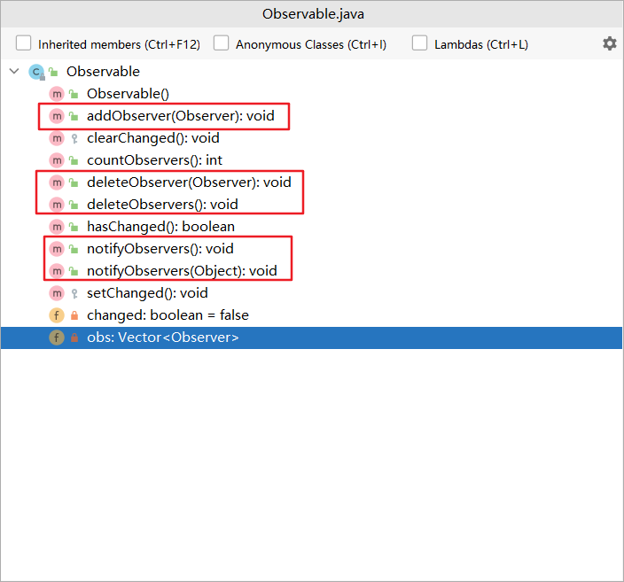

# 观察者模式

#### 定义

>使用观察者模式的系统，当一个对象被修改时，会自动通知依赖于它的对象

#### 原理

###### 原理类图


###### 说明

* ###### Subject接口，声明了对观察者的管理操作及通知更新操作

* ###### Observer接口，声明了更新信息的方法

* ###### ConcreteSubject类，具体实现了对观察者的操作

* ###### ConcreteObserver类，具体实现了更新信息的方法

#### 应用场景

>使用在一个对象的改变将导致其他一个或多个对象也发生改变，且必须通知其它对象的情形

#### 例子

>气象站会把每天测量到的温度、湿度和气压等天气信息以API的形式发布出去，以便于第三方也能接入气象站获取数据。

>现在百度和新浪都制作了自己的天气模块，要求在气象站测量的数据更新时能即时的通知它们。

>问如何编程实现？

#### 传统方式

###### UML类图


###### [代码](../../../../../src/main/java/org/fade/pattern/bp/observer/example)

* ###### 天气当前状况

```java
public class CurrentWeatherCondition {

    private float temperature;

    private float pressure;

    private float humidity;

    public void update(float temperature,float pressure,float humidity){
        this.temperature = temperature;
        this.pressure = pressure;
        this.humidity = humidity;
        this.display();
    }

    public void display(){
        System.out.println("******Today, the temperature is "+this.temperature+"******");
        System.out.println("******Today, the pressure is "+this.pressure+"******");
        System.out.println("******Today, the humidity is "+this.humidity+"******");
    }

}
```

* ###### 天气数据

```java
public class WeatherData {

    private float temperature;

    private float pressure;

    private float humidity;

    private CurrentWeatherCondition currentWeatherCondition;

    public WeatherData(CurrentWeatherCondition currentWeatherCondition){
        this.currentWeatherCondition = currentWeatherCondition;
    }

    public void dataChange(){
        this.currentWeatherCondition.update(this.temperature,this.pressure,this.humidity);
    }

    public void setData(float temperature,float pressure,float humidity){
        this.temperature = temperature;
        this.pressure = pressure;
        this.humidity = humidity;
        this.dataChange();
    }

}
```

* ###### 客户端

```java
public class Client {

    public static void main(String[] args) {
        WeatherData weatherData = new WeatherData(new CurrentWeatherCondition());
        weatherData.setData(25f,1020.3f,0.85f);
    }

}
```

###### 运行结果

```
******Today, the temperature is 25.0******
******Today, the pressure is 1020.3******
******Today, the humidity is 0.85******
```

###### 分析

>传统方式实现下，不利于动态地增加其它的第三方，不利于维护，违反了开闭原则

#### 改进

###### UML类图


###### [代码](../../../../../src/main/java/org/fade/pattern/bp/observer/improve)

* ###### Observer接口

```java
public interface Observer {

    void update(float temperature,float pressure,float humidity);

}
```

* ###### 具体的Observer

```java
public class SinaWeather implements Observer {

    private float temperature;

    private float pressure;

    private float humidity;

    public void update(float temperature,float pressure,float humidity){
        this.temperature = temperature;
        this.pressure = pressure;
        this.humidity = humidity;
        this.display();
    }

    public void display(){
        System.out.println("******Today, the temperature on the Sina Website is "+this.temperature+"******");
        System.out.println("******Today, the pressure on the Sina Website is "+this.pressure+"******");
        System.out.println("******Today, the humidity on the Sina Website is "+this.humidity+"******");
    }

}
```

```java
public class BaiduWeather implements Observer {

    private float temperature;

    private float pressure;

    private float humidity;

    public void update(float temperature,float pressure,float humidity){
        this.temperature = temperature;
        this.pressure = pressure;
        this.humidity = humidity;
        this.display();
    }

    public void display(){
        System.out.println("******Today, the temperature on the Baidu Website is "+this.temperature+"******");
        System.out.println("******Today, the pressure on the Baidu Website is "+this.pressure+"******");
        System.out.println("******Today, the humidity on the Baidu Website is "+this.humidity+"******");
    }

}
```

* ###### Subject接口

```java
public interface Subject {

    void registerObserver(Observer observer);

    void removeObserver(Observer observer);

    void notifyObserver();

}
```

* ###### 具体的Subject

```java
public class WeatherData implements Subject {

    private float temperature;

    private float pressure;

    private float humidity;

    private List<Observer> observers;

    public WeatherData(){
        this.observers = new ArrayList<>();
    }

    public void dataChange(){
        this.notifyObserver();
    }

    public void setData(float temperature,float pressure,float humidity){
        this.temperature = temperature;
        this.pressure = pressure;
        this.humidity = humidity;
        this.dataChange();
    }

    @Override
    public void registerObserver(Observer observer) {
        this.observers.add(observer);
    }

    @Override
    public void removeObserver(Observer observer) {
        if (observers.contains(observer)){
            this.observers.remove(observer);
        }
    }

    @Override
    public void notifyObserver() {
        for (Observer observer:this.observers){
            observer.update(this.temperature,this.pressure,this.humidity);
        }
    }

}
```

* ###### 客户端

```java
public class Client {

    public static void main(String[] args) {
        WeatherData weatherData = new WeatherData();
        Observer baidu = new BaiduWeather();
        Observer sina = new SinaWeather();
        weatherData.registerObserver(baidu);
        weatherData.registerObserver(sina);
        weatherData.setData(25f,1020.3f,0.85f);
    }

}
```

###### 运行结果

```
******Today, the temperature on the Baidu Website is 25.0******
******Today, the pressure on the Baidu Website is 1020.3******
******Today, the humidity on the Baidu Website is 0.85******
******Today, the temperature on the Sina Website is 25.0******
******Today, the pressure on the Sina Website is 1020.3******
******Today, the humidity on the Sina Website is 0.85******
```

#### 在JDK中的应用实例

* ###### java.util

>我们查看java.util.Observer接口的源码，可以发现其定义了更新信息的方法：


>接下来查看java.util.Observable类的源码，可以发现其定义并实现了对观察者的操作：



>而且Observable类中还维护了一个泛型类型为观察者的集合：


#### 优缺点

* ###### 观察者和被观察者是抽象耦合的，建立了一套触发机制

* ###### 符合开闭原则

* ###### 如果一个被观察者对象有很多的直接和间接的观察者的话，将所有的观察者都通知到会花费很多时间

* ###### 如果在观察者和观察目标之间有循环依赖的话，观察目标会触发它们之间的循环调用，可能导致系统崩溃

* ###### 观察者模式没有相应的机制让观察者知道所观察的目标对象是怎么发生变化的，而仅仅只是知道观察目标发生了变化
