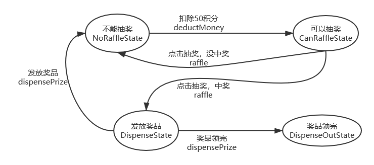
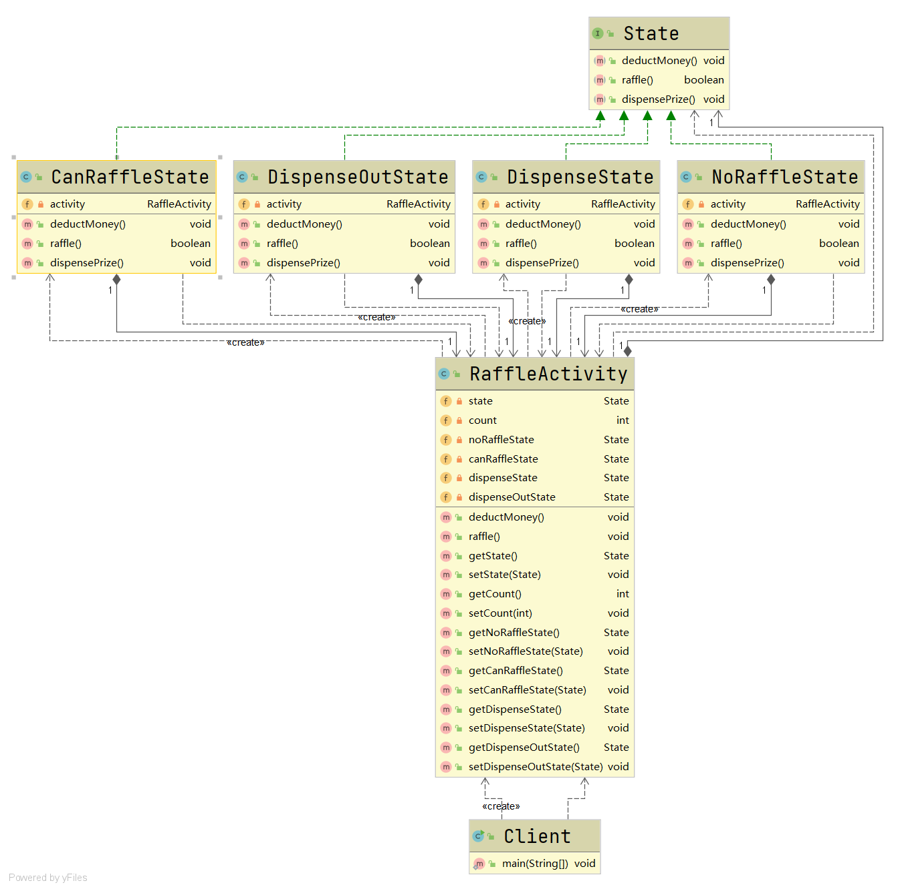
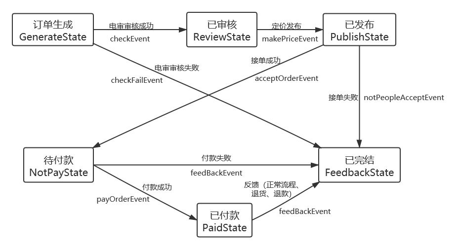
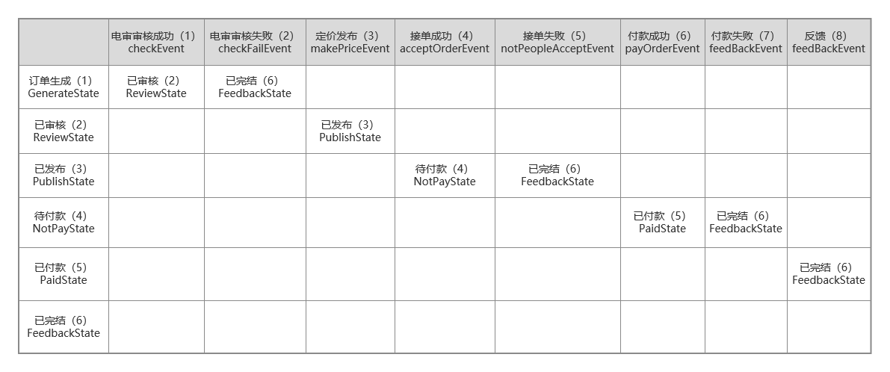
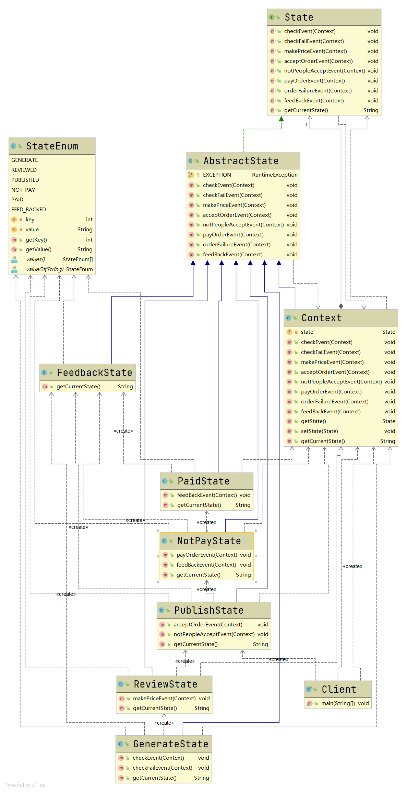

# 状态模式

#### 定义

>主要用来解决对象在多种状态下进行转换时，需要对外输出不同行为的问题。状态和行为是一一对应的，状态之间可以互相转换。

#### 原理

###### 原理类图


###### 说明

* ###### Context，环境类，定义了当前状态

* ###### State，抽象状态，用于封装Context对象的一个特定的状态所对应的行为

* ###### ConcreteState，具体状态类，实现了与Context的一个状态相对应的行为

#### 应用场景

>适用于当一个事件或对象有很多种状态，状态之间会相互进行转换，对不同的状态要求有不同的行为的场景

#### 例子

>请用状态模式实现抽奖活动，具体要求如下：

>(1)每参加一次这个活动要扣除50积分，中奖概率为10%

>(2)奖品的数量是固定的，抽完了就不能再抽了

>(3)活动有四个状态：可以抽奖、不能抽奖、发放奖品和奖品领完

>活动的状态转换图如下所示：



#### 实现

###### UML类图



###### [代码](../../../../../src/main/java/org/fade/pattern/bp/state/impl)

* ###### 抽象状态

```java
public interface State {

    void deductMoney();

    boolean raffle();

    void dispensePrize();

}
```

* ###### 具体状态

```java
public class NoRaffleState implements State {

    private RaffleActivity activity;

    public NoRaffleState(RaffleActivity activity){
        this.activity = activity;
    }

    @Override
    public void deductMoney() {
        System.out.println("扣除50积分成功，您可以抽奖了");
        activity.setState(activity.getCanRaffleState());
    }

    @Override
    public boolean raffle() {
        System.out.println("扣了积分才能抽奖！");
        return false;
    }

    @Override
    public void dispensePrize() {
        System.out.println("不能发放奖品");
    }

}
```

```java
public class DispenseState implements State {

    private RaffleActivity activity;

    public DispenseState(RaffleActivity activity){
        this.activity = activity;
    }

    @Override
    public void deductMoney() {
        System.out.println("不能扣除积分");
    }

    @Override
    public boolean raffle() {
        System.out.println("不能抽奖");
        return false;
    }

    @Override
    public void dispensePrize() {
        if (activity.getCount()>0){
            System.out.println("恭喜中奖了");
            activity.setState(activity.getNoRaffleState());
        }
        else {
            System.out.println("很遗憾，奖品发送完了");
            activity.setState(activity.getDispenseOutState());
            System.exit(0);
        }
    }

}
```

```java
public class DispenseOutState implements State {

    private RaffleActivity activity;

    public DispenseOutState(RaffleActivity activity){
        this.activity = activity;
    }

    @Override
    public void deductMoney() {
        System.out.println("奖品发放完了，请下次再参加");
    }

    @Override
    public boolean raffle() {
        System.out.println("奖品发放完了，请下次再参加");
        return false;
    }

    @Override
    public void dispensePrize() {
        System.out.println("奖品发放完了，请下次再参加");
    }

}
```

```java
public class CanRaffleState implements State {

    private RaffleActivity activity;

    public CanRaffleState(RaffleActivity activity){
        this.activity = activity;
    }

    @Override
    public void deductMoney() {
        System.out.println("已经扣取过了积分");
    }

    @Override
    public boolean raffle() {
        System.out.println("正在抽奖，请稍等！");
        Random random = new Random();
        int num = random.nextInt(10);
        if (num==0){
            activity.setState(activity.getDispenseState());
            return true;
        }
        else {
            System.out.println("很遗憾没有抽中奖品！");
            activity.setState(activity.getNoRaffleState());
            return false;
        }
    }

    @Override
    public void dispensePrize() {
        System.out.println("没中奖，不能发放奖品");
    }

}
```

* ###### Context

```java
public class RaffleActivity {

    private State state;

    private int count;

    private State noRaffleState = new NoRaffleState(this);

    private State canRaffleState = new CanRaffleState(this);

    private State dispenseState = new DispenseState(this);

    private State dispenseOutState = new DispenseOutState(this);

    public RaffleActivity(int count){
        this.state = this.getNoRaffleState();
        this.count = count;
    }

    public void deductMoney(){
        state.deductMoney();
    }

    public void raffle(){
        if (state.raffle()){
            state.dispensePrize();
        }
    }

    public State getState() {
        return state;
    }

    public void setState(State state) {
        this.state = state;
    }

    public int getCount() {
        int currentCount = this.count;
        count--;
        return currentCount;
    }

    public void setCount(int count) {
        this.count = count;
    }

    public State getNoRaffleState() {
        return noRaffleState;
    }

    public void setNoRaffleState(State noRaffleState) {
        this.noRaffleState = noRaffleState;
    }

    public State getCanRaffleState() {
        return canRaffleState;
    }

    public void setCanRaffleState(State canRaffleState) {
        this.canRaffleState = canRaffleState;
    }

    public State getDispenseState() {
        return dispenseState;
    }

    public void setDispenseState(State dispenseState) {
        this.dispenseState = dispenseState;
    }

    public State getDispenseOutState() {
        return dispenseOutState;
    }

    public void setDispenseOutState(State dispenseOutState) {
        this.dispenseOutState = dispenseOutState;
    }

}
```

* ###### 客户端

```java
public class Client {

    public static void main(String[] args) {
        RaffleActivity activity = new RaffleActivity(1);
        for (int i = 0;i<50;i++){
            System.out.println("--------第"+(i+1)+"次抽奖--------");
            activity.deductMoney();
            activity.raffle();
        }
    }

}
```

#### 在项目中的应用实例分析

>某接待平台订单状态如下图所示：





>其中订单的状态会随着操作的不同而改变

>这里的项目就是应用状态模式的一个实例。

###### UML类图



###### [代码](../../../../../src/main/java/org/fade/pattern/bp/state/project)

#### 优缺点

* ###### 有较强的可读性，也方便维护

* ###### 符合开闭原则，容易增删状态

* ###### 会产生较多类，状态一多起来时，就会加大维护难度
