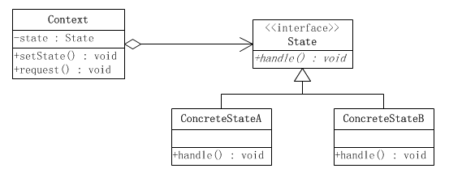

# 状态模式

#### 定义

>主要用来解决对象在多种状态下进行转换时，需要对外输出不同行为的问题。状态和行为是一一对应的，状态之间可以互相转换。

#### 原理

###### 原理类图

###### 说明

* ###### Context，环境类，定义了当前状态

* ###### State，抽象状态，用于封装Context对象的一个特定的状态所对应的行为

* ###### ConcreteState，具体状态类，实现了与Context的一个状态相对应的行为

#### 应用场景

>适用于当一个事件或对象有很多种状态，状态之间会相互进行转换，对不同的状态要求有不同的行为的场景

#### 例子

>请用状态模式实现抽奖活动，具体要求如下：

>(1)每参加一次这个活动要扣除50积分，中奖概率为10%

>(2)
