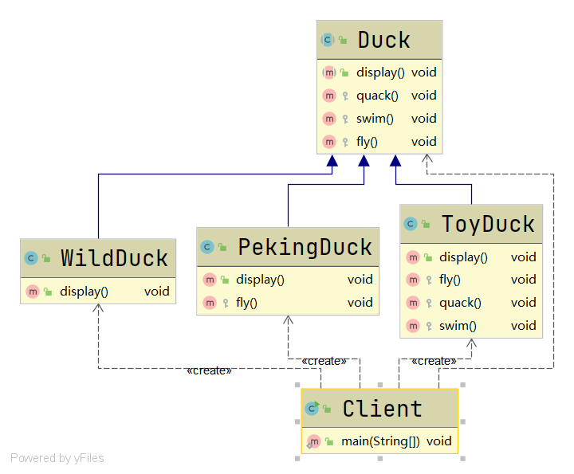
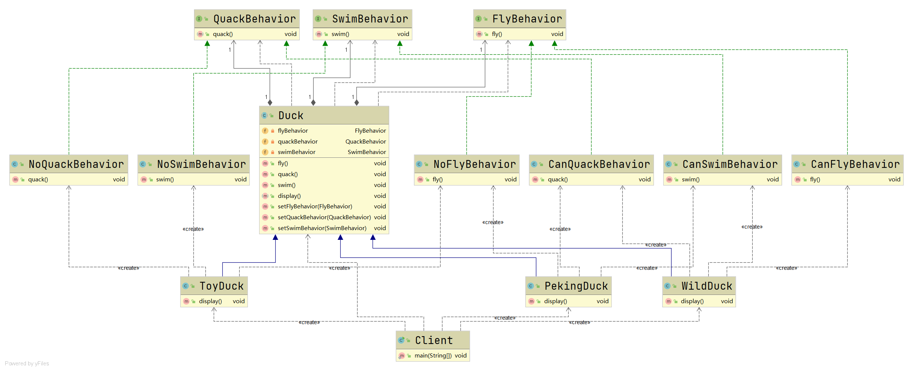
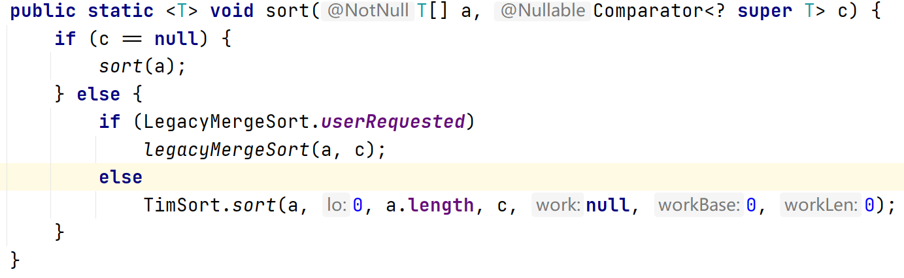
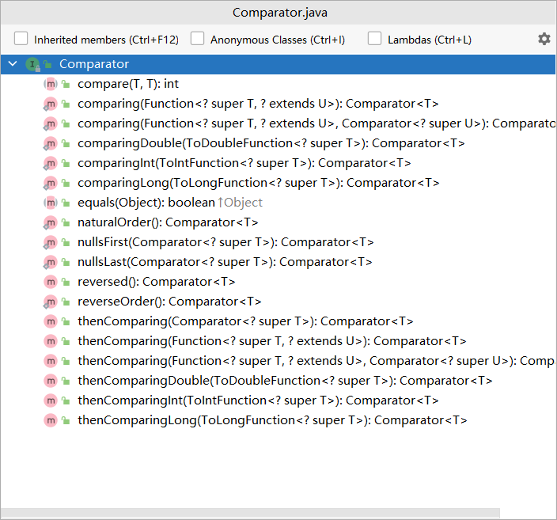

# 策略模式

#### 定义

>即定义算法簇，分别封装起来，让它们之间可以互相替换，从而使算法的变化独立于使用算法的用户

#### 原理

###### 原理类图


###### 说明

* ###### Context，关联策略类

* ###### Strategy，抽象策略，声明相关的算法或行为

* ###### ConcreteStrategy，具体策略类，实现了相关的算法或行为

#### 应用场景

>适用于一个系统需要动态地在几种算法中选择一种的情况

#### 例子

>有一个项目要求显示鸭子的信息，而鸭子有很多种类，它们也有各种行为

#### 传统方式

###### UML类图



###### [代码](../../../../../src/main/java/org/fade/pattern/bp/strategy/example)

###### 分析

>由UML类图可知，各种不同的鸭子都继承了Duck类，自然也就继承了Duck类的所有方法。这就导致对于不具备某种行为的某种鸭子，它需要覆盖父类的方法才能解决问题。并且当改动父类时，也会影响它的子类。所以，传统方式对于这个项目而言，并不是最好的解决办法。

#### 改进

###### UML类图



###### [代码](../../../../../src/main/java/org/fade/pattern/bp/strategy/improve)

#### 在JDK中的应用实例

* ###### java.util.Arrays

>首先来查看下Arrays类中的sort方法



>这里的sort方法会根据传入的Comparator进行排序

>查看Comparator接口的源码



>可以发现其声明了许多抽象方法，其中Arrays类中的sort方法具体会使用到的compare方法就相当于抽象策略类中定义的算法或行为，所以Comparator接口就是抽象策略

>而我们编写的实现这个接口的类就是具体的策略类，如：

```java
import java.util.Arrays;

public class Main {

    public static void main(String[] args) {
        Arrays.sort(new Integer[]{9, 1, 2, 8, 4, 3},
                ((o1, o2) -> o1.compareTo(o2)));
    }

}
```

#### 优缺点

* ###### 相比继承而言，用聚合或组合关联策略更有弹性

* ###### 遵循了开闭原则，客户端增加行为不需要修改原有代码

* ###### 每添加一个策略就要增加一个类，当策略过多时可能会导致类爆炸
