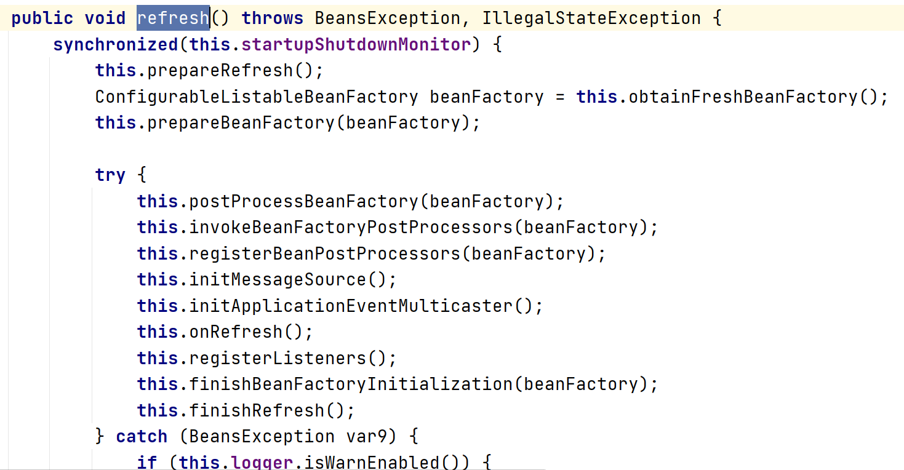
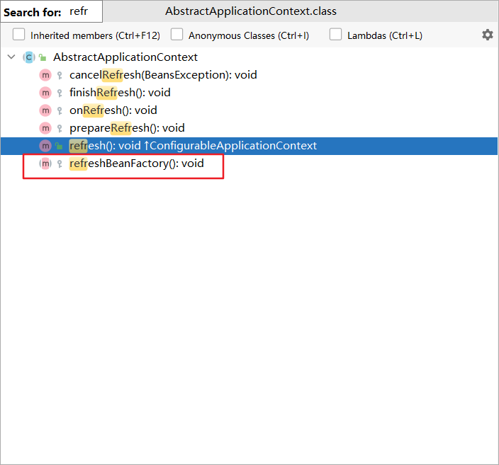

# 模板模式

#### 定义

>在一个抽象类公开定义执行它的方法的模板，子类可以按需要重写方法实现，但调用仍以抽象类中定义的方式进行。

#### 原理

###### 原理类图


###### 叙述

>AbstractClass中实现了模板方法templateMethod()，该方法定义了算法的骨架；AbstractClass还定义了抽象方法step3()和step4()，这些方法由具体子类实现；step2()是钩子方法，提供默认实现，由需要的子类重写。

>一般模板方法还要加上final，以防止子类重写模板方法

#### 应用场景

>模板模式一般使用在：当完成某个过程，而这个过程要执行一系列步骤，并且这一系列步骤基本相同的情景。

#### 例子

>制作豆浆的流程一般为：选材->添加材料->浸泡->打碎材料

>不同的材料可以有不同的口味，但是选材、浸泡和打碎材料这几个步骤对于制作任意口味的豆浆都是一样的。

>问如何使用模板模式实现此方案？

#### 实现

###### UML类图


###### [代码](../../../../../src/main/java/org/fade/pattern/bp/template)

* ###### 豆浆抽象类

```java
public abstract class SoyMilk {

    public void select(){
        System.out.println("挑选材料......");
    }

    public abstract void add();

    public void soak(){
        System.out.println("浸泡材料......");
    }

    public void smash(){
        System.out.println("搅碎材料......");
    }

    /**
     * 是否添加材料
     * 钩子方法
     * */
    public boolean isAdd(){
        return true;
    }

    /**
     * 制作豆浆
     * 模板方法
     * */
    public void make(){
        this.select();
        if (this.isAdd()){
            this.add();
        }
        this.soak();
        this.smash();
    }

}
```

* ###### 加入黑豆的豆浆

```java
public class BlackBeanSoyMilk extends SoyMilk {

    @Override
    public void add() {
        System.out.println("添加了黑豆......");
    }

}
```

* ###### 加入了花生的豆浆

```java
public class PeanutSoyMilk extends SoyMilk {

    @Override
    public void add() {
        System.out.println("加入了花生......");
    }

}
```

* ###### 纯豆浆

```java
public class PureSoyMilk extends SoyMilk {

    @Override
    public void add() {
        //空实现
    }

    /**
     * 是否添加材料
     * 钩子方法
     */
    @Override
    public boolean isAdd() {
        return false;
    }

}
```

* ###### 客户端

```java
public class Client {

    public static void main(String[] args) {
        SoyMilk blackBeanSoyMilk = new BlackBeanSoyMilk();
        SoyMilk peanutSoyMilk = new PeanutSoyMilk();
        SoyMilk pureSoyMilk = new PureSoyMilk();
        System.out.println("--------------制作加了黑豆的豆浆--------------");
        blackBeanSoyMilk.make();
        System.out.println("--------------制作加了花生的豆浆--------------");
        peanutSoyMilk.make();
        System.out.println("--------------制作加了纯豆浆--------------");
        pureSoyMilk.make();
    }

}
```

###### 运行结果

```
--------------制作加了黑豆的豆浆--------------
挑选材料......
添加了黑豆......
浸泡材料......
搅碎材料......
--------------制作加了花生的豆浆--------------
挑选材料......
加入了花生......
浸泡材料......
搅碎材料......
--------------制作加了纯豆浆--------------
挑选材料......
浸泡材料......
搅碎材料......
```

#### 在Spring框架中的应用实例

>接口ConfigurableApplicationContext里定义了模板方法refresh()


>类AbstractApplicationContext实现了ConfigurableApplicationContext接口，实现了接口中定义的模板方法



>模板方法中可以看到其调用了许多方法，其中obtainFreshBeanFactory()方法中包含了两个抽象方法refreshBeanFactory()和getBeanFactory()，它们将由具体的子类实现。




>另外postProcessBeanFactory()和onRefresh()方法是钩子方法


#### 优缺点

* ###### 算法只存在于模板方法中，容易修改，实现了最大化代码复用

* ###### 每一个不同的实现都需要一个子类实现，导致子类的数量增加，使系统变得庞大
