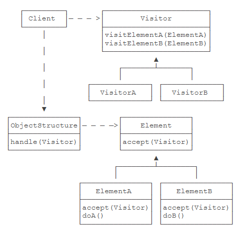
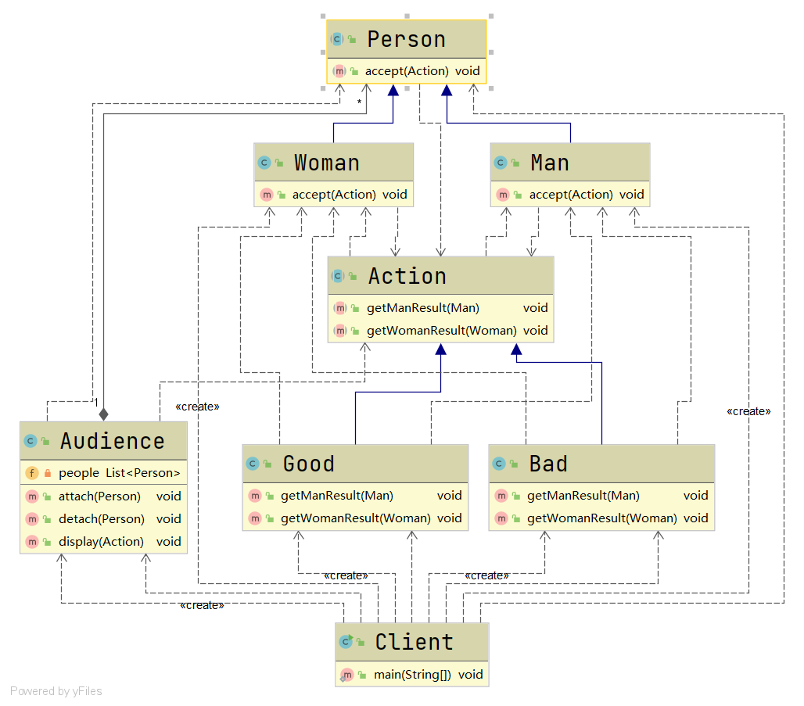

# 访问者模式

#### 定义

>将数据结构与数据操作分离，可以在不改变数据结构的前提下定义作用于这些元素新的操作。

#### 原理

###### 原理类图



###### 叙述

* ###### Visitor是抽象访问者，声明了与数据操作对应的访问方法

* ###### VisitorA与VisitorB是具体的访问者，实现了在抽象访问者中定义的访问方法

* ###### Element是元素，声明了接受方法来接受访问者，该方法的参数必须为抽象访问者类型

* ###### ElementA和ElementB是具体元素，实现了接受方法，用双分派将其调用重定向到相应访问者的相应方法

* ###### ObjectStructure是数据结构，维护了元素，能提供一个接口用于访问者访问元素

#### 应用场景

>使用在需要对一个对象结构中的对象进行很多不同的并且不相关的操作，且需要避免让这些操作"污染"这些对象的类的情况

#### 例子

>某歌唱节目，当歌手演唱完时，男人和女人对歌手会有不同的评价，如成功、失败等。

>问如何使用访问者模式实现该需求？

#### 实现

###### UML类图



###### [代码](../../../../../src/main/java/org/fade/pattern/bp/visitor)

* ###### 抽象访问者

```java
public abstract class Action {

    /**
     * 获得男性评测
     * @param man 男性对象
     * */
    public abstract void getManResult(Man man);

    /**
     * 获得女性评测
     * @param woman 女性对象
     * */
    public abstract void getWomanResult(Woman woman);

}
```

* ###### 具体访问者

```java
public class Good extends Action{

    /**
     * 获得男性评测
     *
     * @param man 男性对象
     */
    @Override
    public void getManResult(Man man) {
        System.out.println("男人的评价是好评......");
    }

    /**
     * 获得女性评测
     *
     * @param woman 女性对象
     */
    @Override
    public void getWomanResult(Woman woman) {
        System.out.println("女人的评价是好评......");
    }

}
```

>这里由于使用了双分派，使得可以在扩展功能时，只需增加扩展类即可，而不需要改动任何其它类的代码

* ###### 具体访问者

```java
public class Bad extends Action{

    /**
     * 获得男性评测
     *
     * @param man 男性对象
     */
    @Override
    public void getManResult(Man man) {
        System.out.println("男人的评价是差评......");
    }

    /**
     * 获得女性评测
     *
     * @param woman 女性对象
     */
    @Override
    public void getWomanResult(Woman woman) {
        System.out.println("女人的评价是差评......");
    }

}
```

* ###### 抽象元素

```java
public abstract class Person {

    /**
     * 接受访问者
     * @param action 访问者
     * */
    public abstract void accept(Action action);

}
```

* ###### 具体元素

```java
public class Man extends Person{

    /**
     * 接受访问者
     *
     * @param action 访问者
     */
    @Override
    public void accept(Action action) {
        action.getManResult(this);
    }

}
```

* ###### 具体元素

```java
public class Woman extends Person{

    /**
     * 接受访问者
     *
     * @param action 访问者
     */
    @Override
    public void accept(Action action) {
        action.getWomanResult(this);
    }

}
```

* ###### 数据结构

```java
public class Audience {

    private List<Person> people = new LinkedList<>();

    public void attach(Person person){
        this.people.add(person);
    }

    public void detach(Person person){
        this.people.remove(person);
    }

    public void display(Action action){
        for (Person person:this.people){
            person.accept(action);
        }
    }

}
```

* ###### 客户端

```java
public class Client {

    public static void main(String[] args) {
        Audience audience = new Audience();
        Person jack = new Man();
        Person rose = new Woman();
        audience.attach(jack);
        audience.attach(rose);
        Good good = new Good();
        audience.display(good);
        System.out.println("======================");
        Bad bad = new Bad();
        audience.display(bad);
    }

}
```

###### 运行结果

```
男人的评价是好评......
女人的评价是好评......
======================
男人的评价是差评......
女人的评价是差评......
```

#### 优缺点

* ###### 符合单一职责原则，灵活性和扩展性好

* ###### 具体元素对访问者公布细节，违反了迪米特法则

* ###### 访问者依赖具体元素，违反了依赖倒转原则
