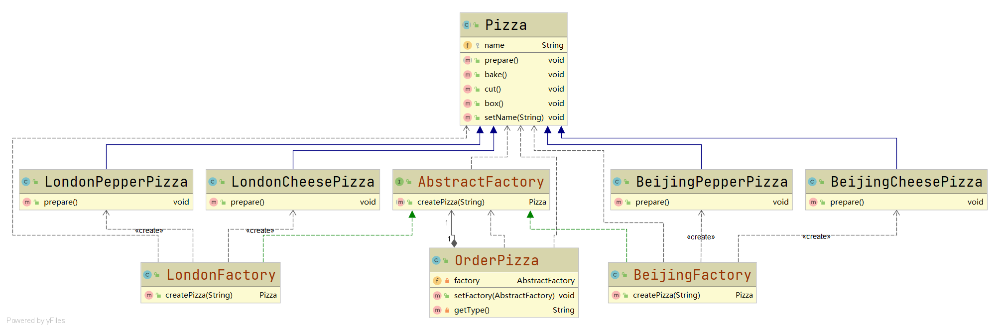

# 抽象工厂模式

#### 定义

>抽象工厂模式将工厂抽象成抽象工厂和具体实现的工厂子类，再根据创建对象类型使用对应的工厂子类以创建对象。

#### 例子

>还是Pizza的例子，[具体参考](../factory/method.md#例子)

>这里使用抽象工厂模式来设计系统



```java
public interface AbstractFactory {

    Pizza createPizza(String type);

}

public class BeijingFactory implements AbstractFactory{

    @Override
    public Pizza createPizza(String type) {
        Pizza pizza = null;
        if (type.equals("cheese")){
            pizza = new BeijingCheesePizza();
        }
        else if(type.equals("pepper")){
            pizza = new BeijingPepperPizza();
        }
        return pizza;
    }

}

public class LondonFactory implements AbstractFactory {

    @Override
    public Pizza createPizza(String type) {
        Pizza pizza = null;
        if (type.equals("cheese")){
            pizza = new LondonCheesePizza();
        }
        else if (type.equals("pepper")){
            pizza = new LondonPepperPizza();
        }
        return pizza;
    }
}

public class OrderPizza {

    private AbstractFactory factory;

    public OrderPizza(){

    }

    public void setFactory(AbstractFactory factory) {
        this.factory = factory;
        Pizza pizza;
        String type;
        do {
            type = getType();
            pizza = factory.createPizza(type);
            if (pizza==null){
                break;
            }
            pizza.prepare();
            pizza.bake();
            pizza.cut();
            pizza.box();
        }while (true);
    }

    private String getType(){
        BufferedReader in = new BufferedReader(new InputStreamReader(System.in));
        System.out.println("Please input pizza type:");
        String type;
        try {
            type = in.readLine();
        } catch (IOException e) {
            e.printStackTrace();
            type = "";
        }
        return type;
    }

}
```

#### 优缺点

* ###### **更为符合**开闭原则

#### [代码](../../../../../src/main/java/org/fade/pattern/cp/abstraction)
