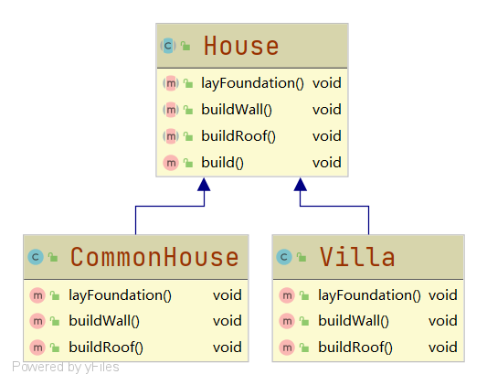
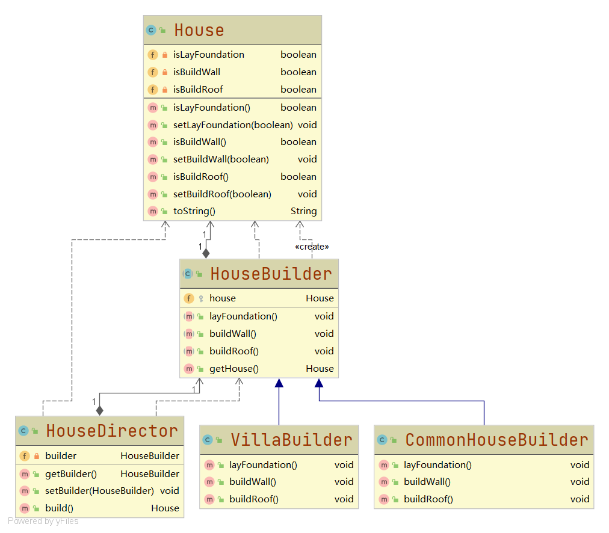
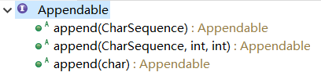
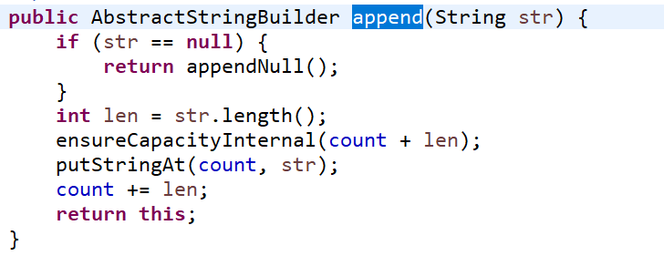
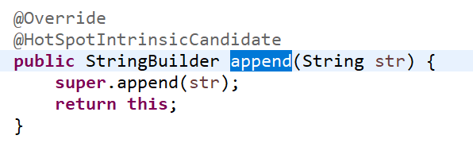

# 建造者模式

#### 定义

>又叫生成器模式，可以将复杂对象的建造过程抽象出来，使这个抽象过程的不同实现方法可以构造出不同属性的对象。它允许用户只指定复杂对象的类型和内容就可以构建，而不需要知道内部的具体构建细节。

#### 例子

>盖房子这一需求的流程是：打地基、砌墙和封顶。

>但是房子的类型是有很多种的，比如：普通房子、高楼和别墅等。这些种类的房子虽然建造过程是一样的，但是过程中的每个步骤的要求是不尽相同的。

#### 传统方式

###### UML类图



###### [代码](../../../../../src/main/java/org/fade/pattern/cp/builder/example)

```java
public abstract class House {

    public abstract void layFoundation();

    public abstract void buildWall();

    public abstract void buildRoof();

    public void build(){
        this.layFoundation();
        this.buildWall();
        this.buildRoof();
    }

}
```

```java
public class CommonHouse extends House {

    @Override
    public void layFoundation() {
        System.out.println("正在为普通房子打地基......");
    }

    @Override
    public void buildWall() {
        System.out.println("正在为普通房子砌墙......");
    }

    @Override
    public void buildRoof() {
        System.out.println("正在为普通房子封顶......");
    }

}
```

```java
public class Villa extends House {

    @Override
    public void layFoundation() {
        System.out.println("正在为别墅打地基......");
    }

    @Override
    public void buildWall() {
        System.out.println("正在为别墅砌墙......");
    }

    @Override
    public void buildRoof() {
        System.out.println("正在为别墅封顶......");
    }

}
```

```java
public class Client {

    public static void main(String[] args) {
        House commonHouse = new CommonHouse();
        House villa = new Villa();
        commonHouse.build();
        villa.build();
    }

}
```

###### 运行结果

```
正在为普通房子打地基......
正在为普通房子砌墙......
正在为普通房子封顶......
正在为别墅打地基......
正在为别墅砌墙......
正在为别墅封顶......
```

###### 分析

* ###### 优点是比较好理解，且简单易操作

* ###### 缺点是过于简单，把产品和创建产品的过程封装在一起了，增强了耦合性，程序的维护和扩展也不方便

#### 建造者模式中的四种角色

* ###### Product

>具体的产品对象

* ###### Builder

>创建Product对象各个部件指定的抽象层（接口/抽象类）

* ###### ConcreteBuilder

>实现Builder，具体创建Product的层次

* ###### Director

>构建一个使用Builder的对象，用于隔离客户和对象的生产过程，也负责控制Product的生产过程

#### 原理类图


#### 改进

###### UML类图



###### [代码](../../../../../src/main/java/org/fade/pattern/cp/builder/improve)

>Product-House

```java
public class House {

    private boolean isLayFoundation;

    private boolean isBuildWall;

    private boolean isBuildRoof;

    public boolean isLayFoundation() {
        return this.isLayFoundation;
    }

    public void setLayFoundation(boolean layFoundation) {
        this.isLayFoundation = layFoundation;
    }

    public boolean isBuildWall() {
        return this.isBuildWall;
    }

    public void setBuildWall(boolean buildWall) {
        this.isBuildWall = buildWall;
    }

    public boolean isBuildRoof() {
        return this.isBuildRoof;
    }

    public void setBuildRoof(boolean buildRoof) {
        this.isBuildRoof = buildRoof;
    }

    @Override
    public String toString() {
        if(this.isLayFoundation&&this.isBuildWall&&this.isBuildRoof){
            return "房子建造完成";
        }
        else if(!(this.isLayFoundation||this.isBuildWall||this.isBuildRoof)){
            return "房子尚未开始建造";
        }
        else{
            return "房子正在建造中";
        }
    }

}
```

>Builder-HouseBuilder

```java
public abstract class HouseBuilder {

    protected House house = new House();

    public abstract void layFoundation();

    public abstract void buildWall();

    public abstract void buildRoof();

    public House getHouse(){
        return this.house;
    }

}
```

>ConcreteBuilder-CommonHouseBuilder

```java
public class CommonHouseBuilder extends HouseBuilder {

    @Override
    public void layFoundation() {
        System.out.println("正在为普通房子打地基......");
        super.house.setLayFoundation(true);
    }

    @Override
    public void buildWall() {
        System.out.println("正在为普通房子砌墙......");
        super.house.setBuildWall(true);
    }

    @Override
    public void buildRoof() {
        System.out.println("正在为普通房子封顶......");
        super.house.setBuildRoof(true);
    }

}
```

>ConcreteBuilder-VillaBuilder

```java
public class VillaBuilder extends HouseBuilder {

    @Override
    public void layFoundation() {
        System.out.println("正在为别墅打地基......");
        super.house.setLayFoundation(true);
    }

    @Override
    public void buildWall() {
        System.out.println("正在为别墅砌墙......");
        super.house.setBuildWall(true);
    }

    @Override
    public void buildRoof() {
        System.out.println("正在为别墅封顶......");
        super.house.setBuildRoof(true);
    }

}
```

>Director-HouseDirector

```java
public class HouseDirector {

    private HouseBuilder builder;

    public HouseBuilder getBuilder() {
        return builder;
    }

    public void setBuilder(HouseBuilder builder) {
        this.builder = builder;
    }

    public House build(){
        this.builder.layFoundation();
        System.out.println(this.builder.getHouse().toString());
        this.builder.buildWall();
        System.out.println(this.builder.getHouse().toString());
        this.builder.buildRoof();
        return builder.getHouse();
    }

}
```

>Client

```java
public class Client {

    public static void main(String[] args) {
        CommonHouseBuilder commonHouseBuilder = new CommonHouseBuilder();
        VillaBuilder villaBuilder = new VillaBuilder();
        HouseDirector director = new HouseDirector();
        System.out.println(commonHouseBuilder.getHouse().toString());
        director.setBuilder(commonHouseBuilder);
        director.build();
        System.out.println(commonHouseBuilder.getHouse().toString());
        System.out.println("**********************split**********************");
        System.out.println(villaBuilder.getHouse().toString());
        director.setBuilder(villaBuilder);
        director.build();
        System.out.println(villaBuilder.getHouse().toString());
    }

}
```

###### 运行结果

```
房子尚未开始建造
正在为普通房子打地基......
房子正在建造中
正在为普通房子砌墙......
房子正在建造中
正在为普通房子封顶......
房子建造完成
**********************split**********************
房子尚未开始建造
正在为别墅打地基......
房子正在建造中
正在为别墅砌墙......
房子正在建造中
正在为别墅封顶......
房子建造完成
```

#### 在JDK中的应用实例

* ###### java.lang.StringBuilder

>Appendable接口定义了多个append抽象方法，所以Appendable扮演着抽象建造者的角色，是Builder



>AbstractStringBuilder虽然是个抽象类，不能实例化，但是它实现了Appendable接口，已扮演着具体建造者的角色，是ConcreteBuilder



>StringBuilder继承了AbstractStringBuilder，也决定了如何使用父类的append方法，所以它既充当了具体建造者的角色也充当了导演的角色，即是ConcreteBuilder和Director



#### 总结

* ###### 建造者模式在实际应用中并不会完全遵照“Builder-ConcreteBuilder-Director-Product”模式来编写

* ###### 增加新的具体建造者无需修改原有类库代码，符合开闭原则

* ###### 建造者模式不适用于产品之间有较大差异的情形

* ###### 抽象工厂模式不关心产品的构建过程，只关心什么产品由什么工厂生产；而建造者模式则要求按指定蓝图构建产品
