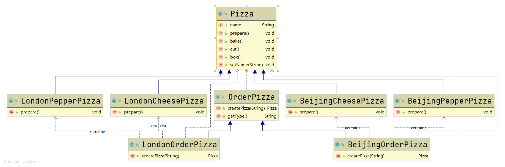

# 工厂方法模式

#### 定义

>工厂方法模式即定义一个抽象方法，将类的实例化推迟到子类完成，由子类来决定应该实例化哪一个类。

#### 例子

>还是Pizza的例子，[具体参考](factory.md#例子)

>相比原来，现在假设需要区别北京和伦敦的Pizza，如果仍使用简单工厂模式，会导致工厂类的逻辑过于复杂，于是下面将使用工厂方法模式来设计系统



```java
public abstract class OrderPizza {

    public OrderPizza(){
        Pizza pizza;
        String type;
        do{
            type = this.getType();
            pizza = this.createPizza(type);
            if(pizza==null){
                break;
            }
            pizza.prepare();
            pizza.bake();
            pizza.cut();
            pizza.box();
        }while (true);
    }

    /**
     * 定义创建对象的抽象方法
     * @param type Pizza种类
     * @return Pizza
     * */
    public abstract Pizza createPizza(String type);

    private String getType(){
        BufferedReader in = new BufferedReader(new InputStreamReader(System.in));
        System.out.println("Please input pizza type:");
        String type;
        try {
            type = in.readLine();
        } catch (IOException e) {
            e.printStackTrace();
            type = "";
        }
        return type;
    }

}

public class LondonOrderPizza extends OrderPizza {

    @Override
    public Pizza createPizza(String type) {
        Pizza pizza = null;
        if (type.equals("cheese")){
            pizza = new LondonCheesePizza();
        }
        else if(type.equals("pepper")){
            pizza = new LondonPepperPizza();
        }
        return pizza;
    }

}

public class BeijingOrderPizza extends OrderPizza {

    @Override
    public Pizza createPizza(String type) {
        Pizza pizza = null;
        if(type.equals("cheese")){
            pizza = new BeijingCheesePizza();
        }
        else if(type.equals("pepper")){
            pizza = new BeijingPepperPizza();
        }
        return pizza;
    }

}
```

>但是上面的例子还是有一些不足的地方，比如子类还是负责了判断的逻辑来决定是生产CheesePizza还是生产PepperPizza，违背了单一职责原则

#### 优缺点

* ###### **更为符合**开闭原则

* ###### 工厂模式可以说是简单工厂模式的进一步抽象和拓展，在保留简单工厂模式的封装优点的同时，让扩展变得简单，让继承变得可行，增加了多态性的体现

#### [代码](../../../../../src/main/java/org/fade/pattern/cp/factory/method)
