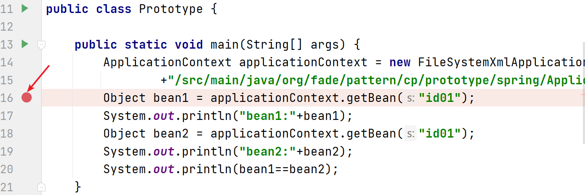
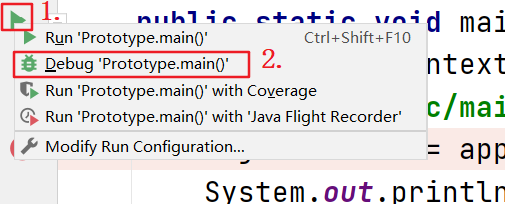
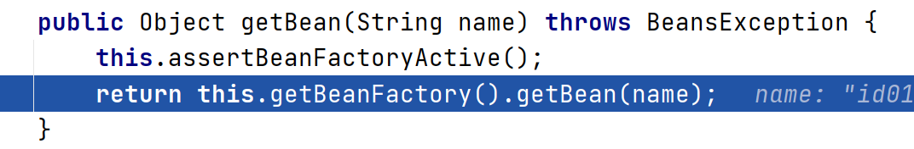
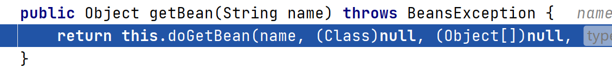
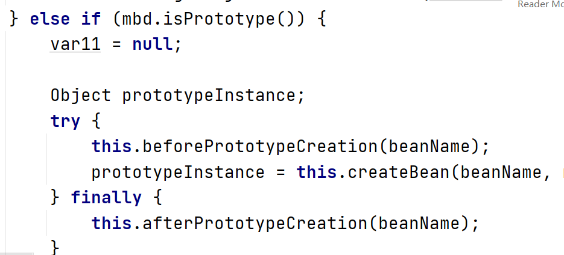

# 原型模式

#### 定义

>原型模式用于创建重复的对象，同时又能保证性能，并且还无需知道创建的细节。这种模式通过需要重复创建对象的类实现原型接口**java.lang.Cloneable**，重写**clone()方法**，来实现创建重复的新对象。

#### 例子

>未采用原型模式下，现在有一只羊，姓名为：Tom，年龄为：1，颜色为：white，问：该如何创建和Tom属性完全相同的10只羊。

```java
public class Sheep {

    private String name;

    private int age;

    private String color;

    public Sheep(String name, int age, String color) {
        super();
        this.name = name;
        this.age = age;
        this.color = color;
    }

    public String getName() {
        return name;
    }

    public void setName(String name) {
        this.name = name;
    }

    public int getAge() {
        return age;
    }

    public void setAge(int age) {
        this.age = age;
    }

    public String getColor() {
        return color;
    }

    public void setColor(String color) {
        this.color = color;
    }

    @Override
    public String toString() {
        return "Sheep{" +
                "name='" + name + '\'' +
                ", age=" + age +
                ", color='" + color + '\'' +
                '}';
    }

}

public class Client {

    public static void main(String[] args) {
        Sheep prototype = new Sheep("Tom",1,"white");
        System.out.println(prototype.toString());
        for (int i = 0;i<10;i++){
            System.out.println("克隆羊"+(i+1)+"："+
                    new Sheep(prototype.getName(),prototype.getAge(),prototype.getColor()).toString());
        }
    }

}
```

>由上面的代码可以看出，虽然如此解决问题比较好理解，并且简单容易操作；但是在创建新的对象时总是需要获取原对象的属性，一旦当需要创建的对象复杂起来时，效率就会变得特别低下。

###### [代码](../../../../../src/main/java/org/fade/pattern/cp/prototype/example)

#### 改进

>采用原型模式来重新解决问题

```java
public class Sheep implements Cloneable {

    private String name;

    private int age;

    private String color;

    public Sheep(String name, int age, String color) {
        super();
        this.name = name;
        this.age = age;
        this.color = color;
    }

    public String getName() {
        return name;
    }

    public void setName(String name) {
        this.name = name;
    }

    public int getAge() {
        return age;
    }

    public void setAge(int age) {
        this.age = age;
    }

    public String getColor() {
        return color;
    }

    public void setColor(String color) {
        this.color = color;
    }

    @Override
    public String toString() {
        return "Sheep{" +
                "name='" + name + '\'' +
                ", age=" + age +
                ", color='" + color + '\'' +
                '}';
    }

    @Override
    protected Object clone() throws CloneNotSupportedException {
        return super.clone();
    }

}

public class Client {

    public static void main(String[] args) {
        Sheep prototype = new Sheep("Tom",1,"white");
        System.out.println(prototype.toString());
        for (int i = 0;i<10;i++){
            try {
                System.out.println("克隆羊"+(i+1)+"："+prototype.clone().toString());
            } catch (CloneNotSupportedException e) {
                e.printStackTrace();
            }
        }
    }

}
```

>与之前的代码相比，可以发现，在采用原型模式创建重复对象时，并不需要知道创建的细节，也不需要重复获取对象的属性，直接调用“对象.clone()”即可。

###### [代码](../../../../../src/main/java/org/fade/pattern/cp/prototype/improve)

#### 在Spring中的源码分析

###### [代码](../../../../../src/main/java/org/fade/pattern/cp/prototype/spring)

```xml
<?xml version="1.0" encoding="UTF-8" ?>
<beans xmlns="http://www.springframework.org/schema/beans"
       xmlns:xsi="http://www.w3.org/2001/XMLSchema-instance"
       xsi:schemaLocation="http://www.springframework.org/schema/beans
       http://www.springframework.org/schema/beans/spring-beans.xsd">

    <bean id="id01" class="org.fade.pattern.cp.prototype.spring.Monster" scope="prototype" />

</beans>
```

```java
public class Monster {

    private Integer id = 10;

    private String nickName = "牛魔王";

    private String skill = "芭蕉扇";

    public Monster(){

    }

    public Monster(Integer id, String nickName, String skill) {
        this.id = id;
        this.nickName = nickName;
        this.skill = skill;
    }

    public Integer getId() {
        return id;
    }

    public void setId(Integer id) {
        this.id = id;
    }

    public String getNickName() {
        return nickName;
    }

    public void setNickName(String nickName) {
        this.nickName = nickName;
    }

    public String getSkill() {
        return skill;
    }

    public void setSkill(String skill) {
        this.skill = skill;
    }

    @Override
    public String toString() {
        return "Monster{" +
                "id=" + id +
                ", nickName='" + nickName + '\'' +
                ", skill='" + skill + '\'' +
                '}';
    }

}

public class Prototype {

    public static void main(String[] args) {
        ApplicationContext applicationContext = new FileSystemXmlApplicationContext(System.getProperty("user.dir")
                +"/src/main/java/org/fade/pattern/cp/prototype/spring/ApplicationContext.xml");
        Object bean1 = applicationContext.getBean("id01");
        System.out.println("bean1:"+bean1);
        Object bean2 = applicationContext.getBean("id01");
        System.out.println("bean2:"+bean2);
        System.out.println(bean1==bean2);
    }

}
```

###### 运行结果

```
bean1:Monster{id=10, nickName='牛魔王', skill='芭蕉扇'}
bean2:Monster{id=10, nickName='牛魔王', skill='芭蕉扇'}
false
```

###### DEBUG调试

1. ###### 单击图示处打上断点



2. ###### 右键点击图示1处，选择图示2处选项“Debug 'Prototype.main()'”



3. ###### 等调试系统上线后，点击图示处选项“Step Into”


4. ###### 再点击图示处选项“Step Over”


5. ###### 当代码运行至下图所示时，再次点击选项“Step Into”



6. ###### 当出现如下图所示内容时，点击“getBean”


7. ###### 当出现如下图所示内容时，点击选项“Step Into”




8. ###### 滚动页面，当代码为下图所示的内容时，可以发现此处Spring中确实采用了原型模式




