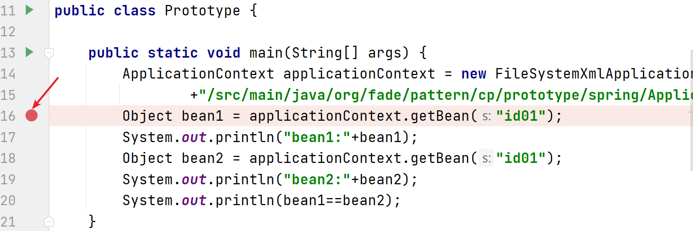
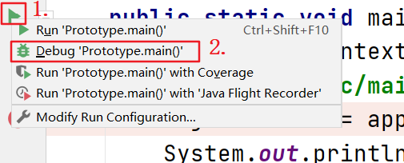
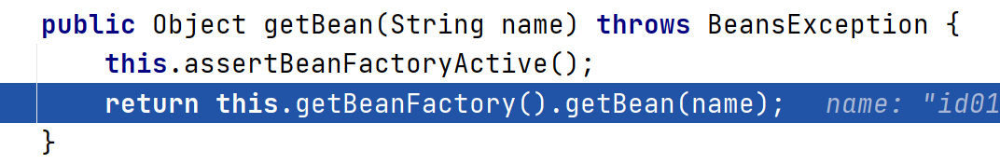
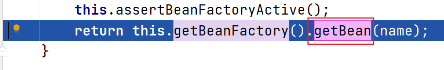
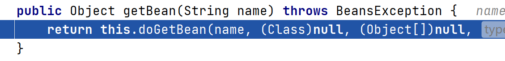
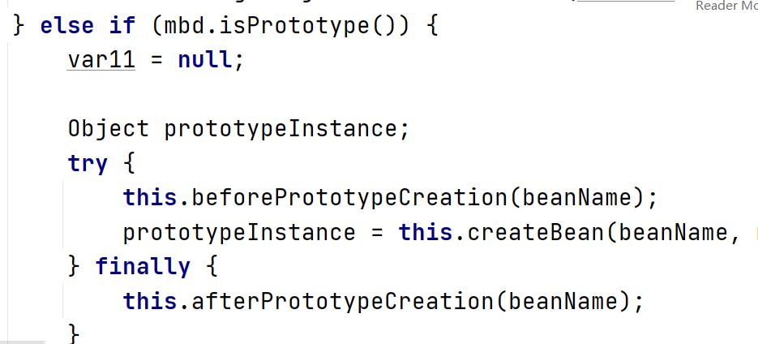

# 在Spring中的源码分析

#### 例子

```xml
<?xml version="1.0" encoding="UTF-8" ?>
<beans xmlns="http://www.springframework.org/schema/beans"
       xmlns:xsi="http://www.w3.org/2001/XMLSchema-instance"
       xsi:schemaLocation="http://www.springframework.org/schema/beans
       http://www.springframework.org/schema/beans/spring-beans.xsd">

    <bean id="id01" class="org.fade.pattern.cp.prototype.spring.Monster" scope="prototype" />

</beans>
```

```java
public class Monster {

    private Integer id = 10;

    private String nickName = "牛魔王";

    private String skill = "芭蕉扇";

    public Monster(){

    }

    public Monster(Integer id, String nickName, String skill) {
        this.id = id;
        this.nickName = nickName;
        this.skill = skill;
    }

    public Integer getId() {
        return id;
    }

    public void setId(Integer id) {
        this.id = id;
    }

    public String getNickName() {
        return nickName;
    }

    public void setNickName(String nickName) {
        this.nickName = nickName;
    }

    public String getSkill() {
        return skill;
    }

    public void setSkill(String skill) {
        this.skill = skill;
    }

    @Override
    public String toString() {
        return "Monster{" +
                "id=" + id +
                ", nickName='" + nickName + '\'' +
                ", skill='" + skill + '\'' +
                '}';
    }

}

public class Prototype {

    public static void main(String[] args) {
        ApplicationContext applicationContext = new FileSystemXmlApplicationContext(System.getProperty("user.dir")
                +"/src/main/java/org/fade/pattern/cp/prototype/spring/ApplicationContext.xml");
        Object bean1 = applicationContext.getBean("id01");
        System.out.println("bean1:"+bean1);
        Object bean2 = applicationContext.getBean("id01");
        System.out.println("bean2:"+bean2);
        System.out.println(bean1==bean2);
    }

}
```

#### 运行结果

```
bean1:Monster{id=10, nickName='牛魔王', skill='芭蕉扇'}
bean2:Monster{id=10, nickName='牛魔王', skill='芭蕉扇'}
false
```

#### [代码](../../../../../src/main/java/org/fade/pattern/cp/prototype/spring)

#### DEBUG调试

1. ###### 单击图示处打上断点



2. ###### 右键点击图示1处，选择图示2处选项“Debug 'Prototype.main()'”



3. ###### 等调试系统上线后，点击图示处选项“Step Into”


4. ###### 再点击图示处选项“Step Over”


5. ###### 当代码运行至下图所示时，再次点击选项“Step Into”



6. ###### 当出现如下图所示内容时，点击“getBean”



7. ###### 当出现如下图所示内容时，点击选项“Step Into”




8. ###### 滚动页面，当代码为下图所示的内容时，可以发现此处Spring中确实采用了原型模式




