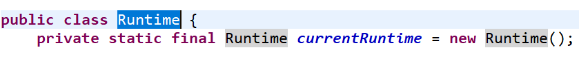
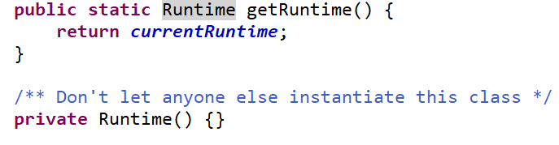

# 单例模式

#### 定义

>所谓单例模式，就是采取一定的办法保证在整个软件系统中，对某个类只能存在一个对象实例，并且该类只提供一个获取其对象实例的办法。

#### 使用场景

>需要频繁进行创建和销毁的对象、创建对象时耗时过多或耗费资源过多的对象、工具类对象、频繁访问数据库或文件的对象.....

#### 实现方式

* #### [饿汉式(静态常量)](hungry/constant.md)

* #### [饿汉式(静态代码块)](hungry/block.md)

* #### [懒汉式(线程不安全)](lazy/insecure.md)

* #### [懒汉式(线程安全，同步方法)](lazy/method.md)

* #### [懒汉式(线程不安全，同步代码块)](lazy/block.md)

* #### [双重检查](dcl/dcl.md)

* #### [静态内部类](inner/inner.md)

* #### [枚举](enumerate/enumerate.md)

#### 在JDK中的应用实例

* ###### java.lang.Runtime

