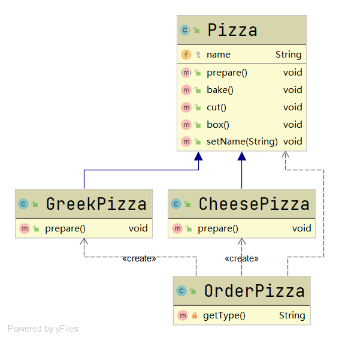
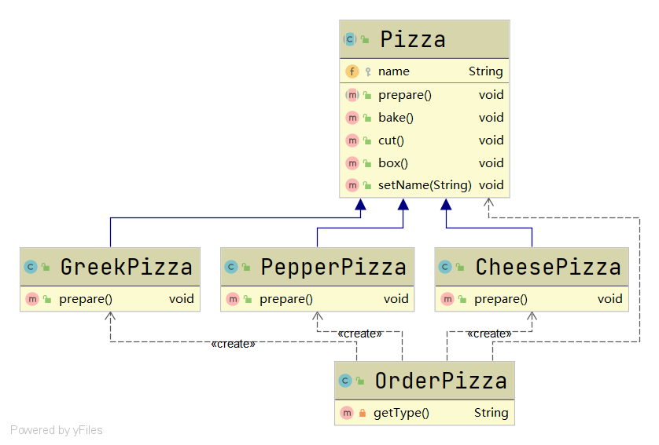

# 工厂模式

#### 定义

>所谓工厂模式，就是使系统在创建对象时不会对客户端暴露创建逻辑

#### 例子

>未采取工厂模式下，假设有一家Pizza店，现在Pizza店有CheesePizza和GreekPizza两种Pizza，这时突然店里多了一种PepperPizza，那么应该如何对系统进行修改。



```java
public class OrderPizza {

    public OrderPizza(){
        Pizza pizza;
        String type;
        do {
            type = getType();
            if (type.equals("greek")){
                pizza = new GreekPizza();
                pizza.setName("GreekPizza");
            }
            else if (type.equals("cheese")){
                pizza = new CheesePizza();
                pizza.setName("CheesePizza");
            }
            //增加新的pizza需增加逻辑处理
//            else if (type.equals("pepper")){
//                pizza = new PepperPizza();
//                pizza.setName("PepperPizza");
//            }
            else {
                break;
            }
            pizza.prepare();
            pizza.bake();
            pizza.cut();
            pizza.box();
        }while (true);
    }

    private String getType(){
        BufferedReader in = new BufferedReader(new InputStreamReader(System.in));
        System.out.println("Please input pizza type:");
        String type;
        try {
            type = in.readLine();
        } catch (IOException e) {
            e.printStackTrace();
            type = "";
        }
        return type;
    }

}
```

>增加PepperPizza后：



```java
public class OrderPizza {

    public OrderPizza(){
        Pizza pizza;
        String type;
        do {
            type = getType();
            if (type.equals("greek")){
                pizza = new GreekPizza();
                pizza.setName("GreekPizza");
            }
            else if (type.equals("cheese")){
                pizza = new CheesePizza();
                pizza.setName("CheesePizza");
            }
            //增加新的pizza需增加逻辑处理
            else if (type.equals("pepper")){
                pizza = new PepperPizza();
                pizza.setName("PepperPizza");
            }
            else {
                break;
            }
            pizza.prepare();
            pizza.bake();
            pizza.cut();
            pizza.box();
        }while (true);
    }

    private String getType(){
        BufferedReader in = new BufferedReader(new InputStreamReader(System.in));
        System.out.println("Please input pizza type:");
        String type;
        try {
            type = in.readLine();
        } catch (IOException e) {
            e.printStackTrace();
            type = "";
        }
        return type;
    }

}
```

>对比一下就很容易得出这样的结论，当扩展提供方功能时，也对使用方进行了修改，对客户端暴露了创建逻辑，违背了开闭原则。

>[代码](../../../../src/main/java/org/fade/pattern/factory/example)

#### 实现方式

* #### [简单工厂模式](simple.md)

* #### [工厂方法模式](method.md)


