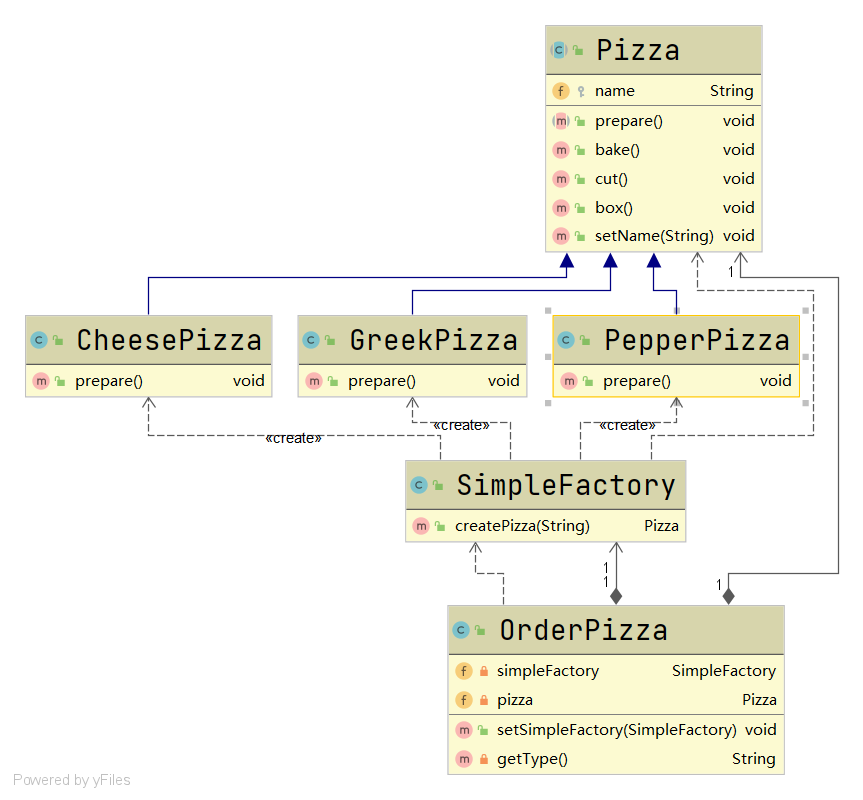

# 简单工厂模式

#### 定义

>定义一个工厂类，根据传入参数的不同返回不同的实例，被创建的实例具有共同的父类或接口。为了方便调用，通常把创建实例的方法设置为静态的，故也被称为静态工厂模式。

#### 例子

>还是Pizza的例子，[具体参考](factory.md#例子)

>我们于是采用简单工厂模式来设计系统



```java
public class SimpleFactory {

    /**
     * 根据type返回对应的Pizza实例
     * @param type Pizza type
     * @return Pizza
     * */
    public Pizza createPizza(String type){
        Pizza pizza = null;
        if (type.equals("greek")){
            pizza = new GreekPizza();
            pizza.setName("GreekPizza");
        }
        else if (type.equals("cheese")){
            pizza = new CheesePizza();
            pizza.setName("CheesePizza");
        }
        else if (type.equals("pepper")){
            pizza = new PepperPizza();
            pizza.setName("PepperPizza");
        }
        return pizza;
    }

}

public class OrderPizza {

    /**
     * 简单工厂对象
     * */
    private SimpleFactory simpleFactory;

    private Pizza pizza;

    public OrderPizza(SimpleFactory simpleFactory){
        setSimpleFactory(simpleFactory);
    }

    public void setSimpleFactory(SimpleFactory simpleFactory) {
        String type;
        this.simpleFactory = simpleFactory;
        do {
            type = getType();
            this.pizza = this.simpleFactory.createPizza(type);
            if (this.pizza!=null){
                System.out.println("Pizza订购成功");
                pizza.prepare();
                pizza.bake();
                pizza.cut();
                pizza.box();
            }
            else{
                System.out.println("Pizza订购失败");
                break;
            }
        }while (true);
    }

    private String getType(){
        BufferedReader in = new BufferedReader(new InputStreamReader(System.in));
        System.out.println("Please input pizza type:");
        String type;
        try {
            type = in.readLine();
        } catch (IOException e) {
            e.printStackTrace();
            type = "";
        }
        return type;
    }

}
```

>由上面的代码可以知道，此时创建Pizza实例是由工厂完成的，SimpleFactory根据传入的type的不同创建不同的实例。这时如若要增加Pizza的品种，就不需要修改OrderPizza的代码了，但是仍然需要修改SimpleFactory。

#### 优缺点

* ###### 使使用者不用关心对象创建逻辑，实现了解耦

* ###### 仍然违背了开闭原则，一旦变化需求就有可能需要修改工厂类的代码

#### [代码](../../../../src/main/java/org/fade/pattern/factory/simple)
