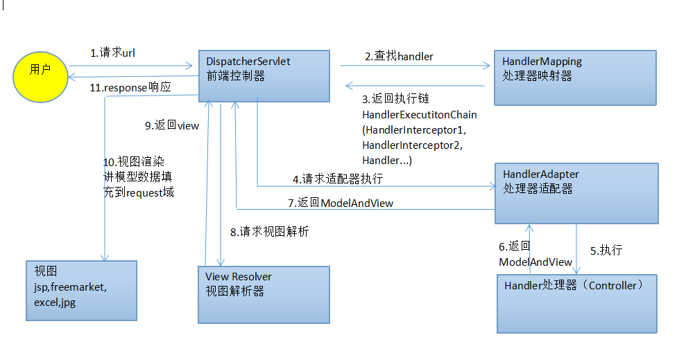
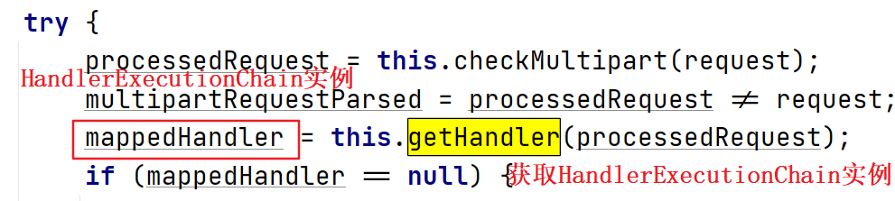
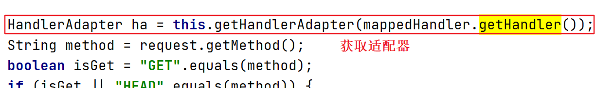
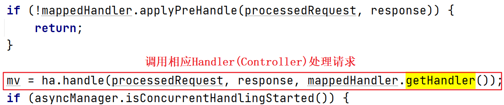
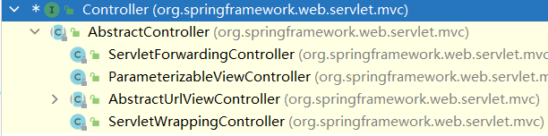

# 适配器模式

#### 定义

>适配器模式将某个类的接口转换成客户端期望的另一个接口表示，让原本因接口不匹配而不能一起工作的两个类可以协同工作。

#### 例子

>生活中插座提供的电压是220V交流电，但是我们的手机充电需要的是5V直流电（假设），所以这就需要充电器将220V交流电转换成5V直流电。请问如何用代码来实现这个例子？

#### 实现方式

* ###### [类适配器](clz/clz.md)

* ###### [对象适配器](obj/obj.md)

* ###### [接口适配器](intf/intf.md)

#### 在SpringMVC框架中的应用实例

###### 源码分析

>回忆下SpringMVC处理请求的流程：

>可以看到流程中有这么一步，在HandlerMapping返回一个HandlerExecutionChain实例后，DispatcherServlet会根据这个HandlerExecutionChain实例去请求相应的适配器适配，适配器则会调用相应Handler(Controller)处理请求。代码如下图所示：

>至于为什么这里要使用适配器模式，这是因为这里Handler的实现方式有多种，那么调用处理请求的方法的方式也就是不确定的。如果不采取适配器模式的话，那么调用的时候就不得不使用大量if-else来判断，这对于扩展功能是不利的。

###### [流程模拟](mvc/mvc.md)
