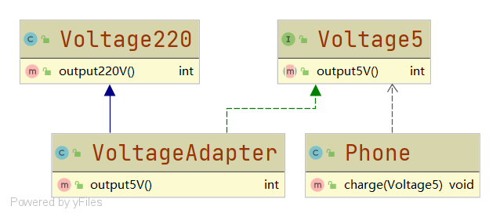

# 类适配器

#### 定义

>即通过适配器类继承被适配者的类，实现目标接口，完成被适配者到目标的转换。

#### 例子

>还是手机充电的例子，[具体参考](../adapter.md#例子)

>这里使用类适配器来完成适配

#### UML类图



#### [代码](../../../../../../src/main/java/org/fade/pattern/sp/adapter/clz)

###### 220V电压

```java
public class Voltage220 {

    /**
     * 输出220V电压
     * */
    public int output220V(){
        return 220;
    }

}
```

###### 5V电压

```java
public interface Voltage5 {

    int output5V();

}
```

###### 适配器

```java
public class VoltageAdapter extends Voltage220 implements Voltage5 {

    @Override
    public int output5V() {
        int src = super.output220V();
        return src / 44;
    }

}
```

###### 手机

```java
public class Phone {

    public void charge(Voltage5 voltage){
        int dst = voltage.output5V();
        if (dst>0&&dst<=5){
            System.out.println("可以开始充电");
        }
        else if (dst==0){
            System.out.println("未转换成功，电压为0");
        }
        else{
            System.out.println("电压过高，不能充电");
        }
    }

}
```

###### 客户端

```java
public class Client {

    public static void main(String[] args) {
        Phone phone = new Phone();
        phone.charge(new VoltageAdapter());
    }

}
```

#### 运行结果

```
可以开始充电
```

#### 优缺点

* ###### 由于Java单继承的限制，在继承被适配者类的同时，就要求了目的方只能以接口的形式实现，有一定的局限性

* ###### 被适配者类的所有方法都会在适配器中暴露出来

* ###### 但是继承被适配者的类的同时也可以使适配器重写父类方法，具有一定的灵活性
