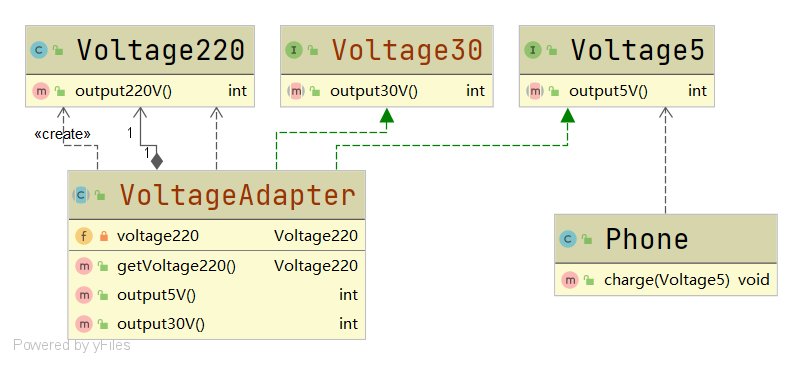

# 接口适配器

#### 定义

>即当不想全部实现接口提供的方法时，可设计一个抽象类实现接口，并为其提供空实现，那么抽象类的子类就可以有选择地覆盖父类的某些方法来实现自己的需求。

>典型的用法是，通过匿名内部类有选择地覆盖具有空实现的抽象父类。

#### 例子

>还是手机充电的例子，[具体参考](../adapter.md#例子)

>此时增加了一个需求，有一个手机，它充电所要求的电压是30V，这就需要适配器具有将220V电压转换为30V电压的功能。但是此刻使用适配器的还是充电电压为5V的手机，并不需要适配器将220V电压转换为30V电压的功能。

>这里就可以使用接口适配器来完成适配

#### UML类图



#### 代码

###### 30V电压

```java
public interface Voltage30 {

    int output30V();

}
```

###### 适配器

```java
public abstract class VoltageAdapter implements Voltage5,Voltage30 {

    private Voltage220 voltage220;

    public VoltageAdapter(){
        voltage220 = new Voltage220();
    }

    public Voltage220 getVoltage220() {
        return voltage220;
    }

    @Override
    public int output5V() {
        return 0;
    }

    @Override
    public int output30V() {
        return 0;
    }

}
```

###### 客户端

```java
public class Client {

    public static void main(String[] args) {
        Phone phone = new Phone();
        phone.charge(new VoltageAdapter() {

            @Override
            public int output5V() {
                int src = this.getVoltage220().output220V();
                return src / 44;
            }

        });
    }

}
```

#### 运行结果

```
可以开始充电
```

#### 优缺点

* ###### 灵活度高
