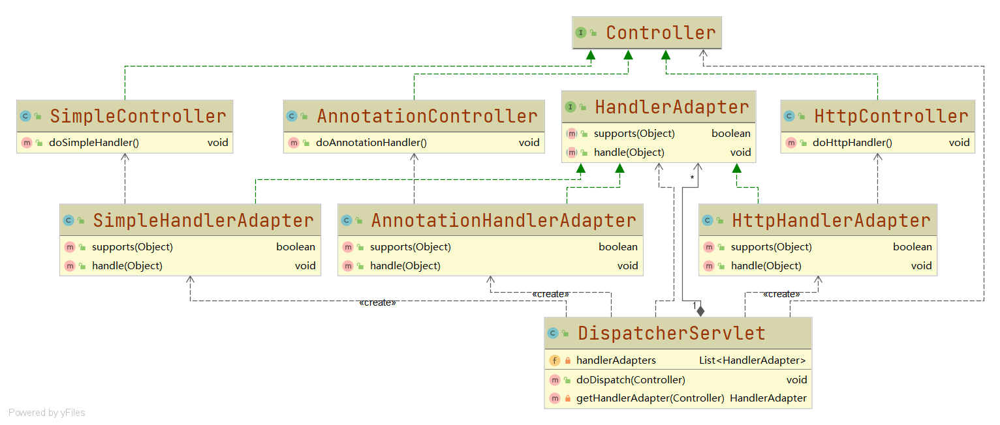

# 模拟SpringMVC处理流程中适配器适配过程

#### UML类图



#### [代码](../../../../../../src/main/java/org/fade/pattern/sp/adapter/mvc)

>Controller接口

```java
public interface Controller {


}
```

>AnnotationController

```java
public class AnnotationController implements Controller {

    public void doAnnotationHandler(){
        System.out.println("annotation...");
    }

}
```

>HttpController

```java
public class HttpController implements Controller {

    public void doHttpHandler(){
        System.out.println("http...");
    }

}
```

>SimpleController

```java
public class SimpleController implements Controller {

    public void doSimpleHandler(){
        System.out.println("simple...");
    }

}
```

>HandlerAdapter接口

```java
public interface HandlerAdapter {

    boolean supports(Object handler);

    void handle(Object handler);

}
```

>AnnotationHandlerAdapter

```java
public class AnnotationHandlerAdapter implements HandlerAdapter {

    @Override
    public boolean supports(Object handler) {
        return (handler instanceof AnnotationController);
    }

    @Override
    public void handle(Object handler) {
        ((AnnotationController)handler).doAnnotationHandler();
    }

}
```

>HttpHandlerAdapter

```java
public class HttpHandlerAdapter implements HandlerAdapter {

    @Override
    public boolean supports(Object handler) {
        return (handler instanceof HttpController);
    }

    @Override
    public void handle(Object handler) {
        ((HttpController)handler).doHttpHandler();
    }

}
```

>SimpleHandlerAdapter

```java
public class SimpleHandlerAdapter implements HandlerAdapter {

    @Override
    public boolean supports(Object handler) {
        return (handler instanceof SimpleController);
    }

    @Override
    public void handle(Object handler) {
        ((SimpleController)handler).doSimpleHandler();
    }

}
```

>DispatcherServlet分发器

```java
public class DispatcherServlet {

    private List<HandlerAdapter> handlerAdapters;

    public DispatcherServlet(){
        handlerAdapters = new ArrayList<>();
        handlerAdapters.add(new AnnotationHandlerAdapter());
        handlerAdapters.add(new HttpHandlerAdapter());
        handlerAdapters.add(new SimpleHandlerAdapter());
    }

    public void doDispatch(Controller controller){
        try {
            //获取HandlerAdapter
            HandlerAdapter adapter = this.getHandlerAdapter(controller);
            //调用Controller对应方法
            adapter.handle(controller);
        } catch (Exception e) {
            e.printStackTrace();
        }
    }

    private HandlerAdapter getHandlerAdapter(Controller controller) throws Exception {
        if (this.handlerAdapters!=null){
            Iterator<HandlerAdapter> iterator = this.handlerAdapters.iterator();
            while(iterator.hasNext()){
                HandlerAdapter adapter = iterator.next();
                if (adapter.supports(controller)){
                    return adapter;
                }
            }
        }
        throw new Exception("No adapter for handler [" + controller + "]: The DispatcherServlet configuration needs to include a HandlerAdapter that supports this handler");
    }

}
```

>客户端

```java
public class Client {

    public static void main(String[] args) {
        DispatcherServlet dispatcherServlet = new DispatcherServlet();
        dispatcherServlet.doDispatch(new HttpController());
        dispatcherServlet.doDispatch(new AnnotationController());
        dispatcherServlet.doDispatch(new SimpleController());
    }

}
```

#### 运行结果

```
http...
annotation...
simple...
```


