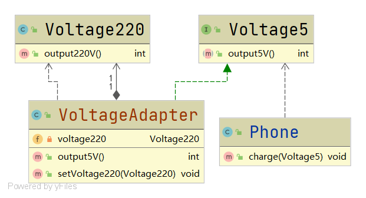

# 对象适配器

#### 定义

>与类适配器思路大体相同，只是适配器不再继承被适配者的类，而是通过使用关联关系来持有被适配者

#### 例子

>还是手机充电的例子，[具体参考](../adapter.md#例子)

>这里使用对象适配器来完成适配

#### UML类图



#### 代码

###### 适配器

```java
public class VoltageAdapter implements Voltage5 {

    private Voltage220 voltage220;

    @Override
    public int output5V() {
        int src = 0;
        if (this.voltage220!=null){
            src = this.voltage220.output220V();
            return src / 44;
        }
        else{
            return src;
        }
    }

    public void setVoltage220(Voltage220 voltage220) {
        this.voltage220 = voltage220;
    }

}
```

###### 客户端

```java
public class Client {

    public static void main(String[] args) {
        Phone phone = new Phone();
        VoltageAdapter adapter = new VoltageAdapter();
        adapter.setVoltage220(new Voltage220());
        phone.charge(adapter);
    }

}
```

#### 运行结果

```
可以开始充电
```

#### 优缺点

* ###### 符合合成复用原则

* ###### 解决了适配器必须继承被适配者的局限性问题，也不再要求目标方必须以接口的方式实现

* ###### 使用成本更低，更为灵活
