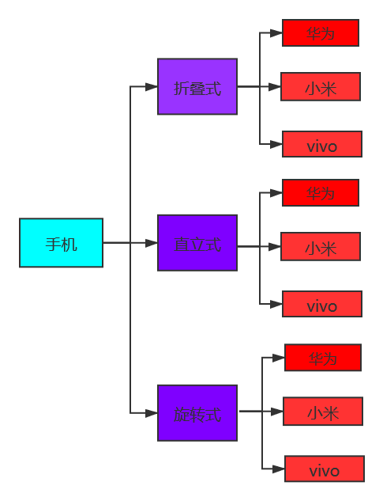
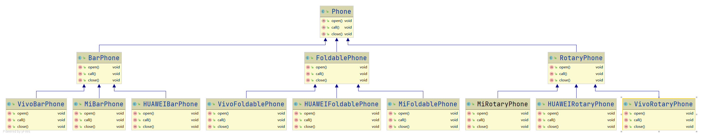
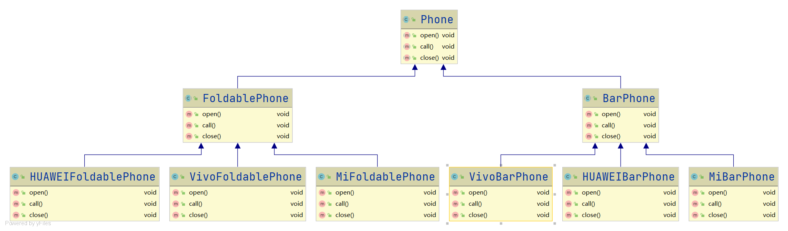
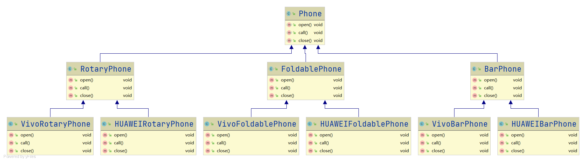
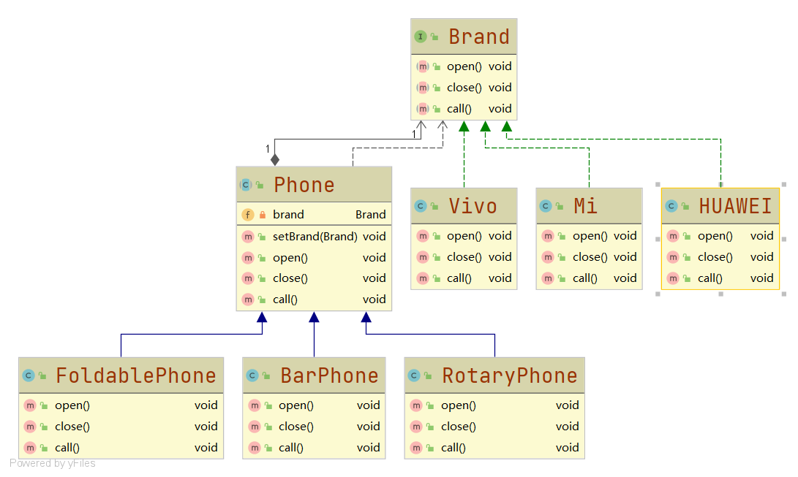
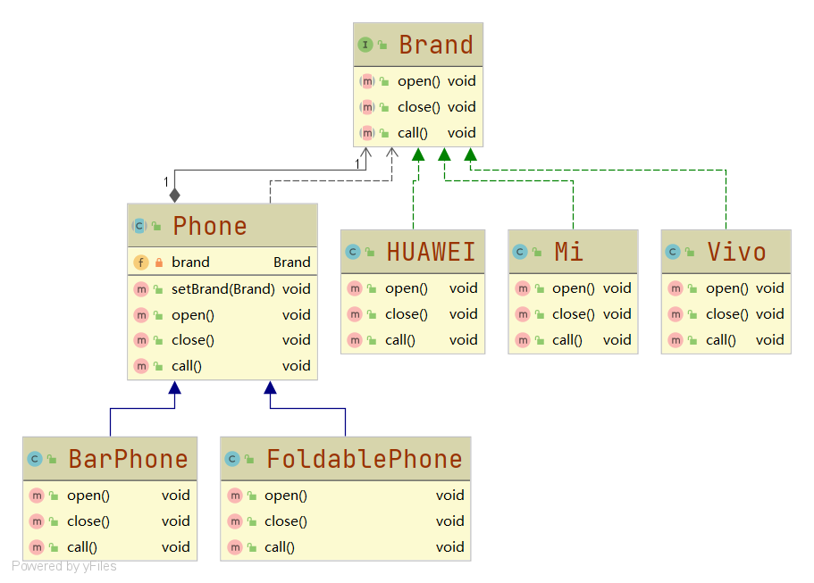
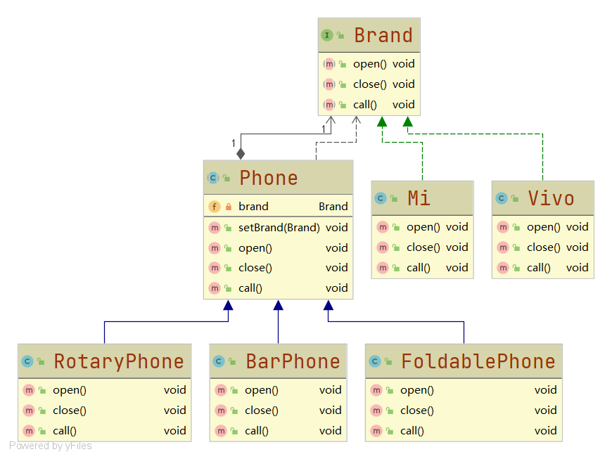

# 桥接模式

#### 定义

>即基于类最少的原则，将实现与抽象放在两个不同的类层次，使抽象部分与实现部分分离，实现了抽象化与实现化的解耦。

#### 例子

>对不同类型不同品牌的手机的操作（开机、打电话和关机等）进行编程，手机间的层次关系如下图所示：

#### 传统方式

###### UML类图

###### [代码](../../../../../src/main/java/org/fade/pattern/sp/bridge/example)

>由于代码过多，这里就不再展示代码

###### 分析

>显然这种设计方式，在要进行扩展时是很不好的。

>假设某一时刻，UML类图如下所示，如果想要增加样式为旋转的手机，应该怎么修改？

>又假设某一时刻，UML类图如下所示，如果想要增加品牌为小米的手机，应该怎么修改？

>答案对比下[前面的UML类图](./bridge.md#UML类图)就很容易知道：需要增加大量的类文件。

>这样不仅会导致类爆炸，还违背了单一职责原则，不利于系统的维护

#### 改进

###### UML类图

###### [代码](../../../../../src/main/java/org/fade/pattern/sp/bridge/improve)

>由于代码过多，这里就不再展示代码

###### 分析

>现作[如上的假设](./bridge.md#分析)：

>假设某一时刻，UML类图如下所示，如果想要增加样式为旋转的手机，应该怎么修改？

>又假设某一时刻，UML类图如下所示，如果想要增加品牌为华为的手机，应该怎么修改？

>对比下[UML类图](./bridge.md#UML类图)，增加样式为旋转的手机只需要增加一个名为RotaryPhone的类，增加品牌为华为的手机只需为Brand增加一个名为HUAWEI的实现类即可

>这样明显比传统方式具有更好的维护性
