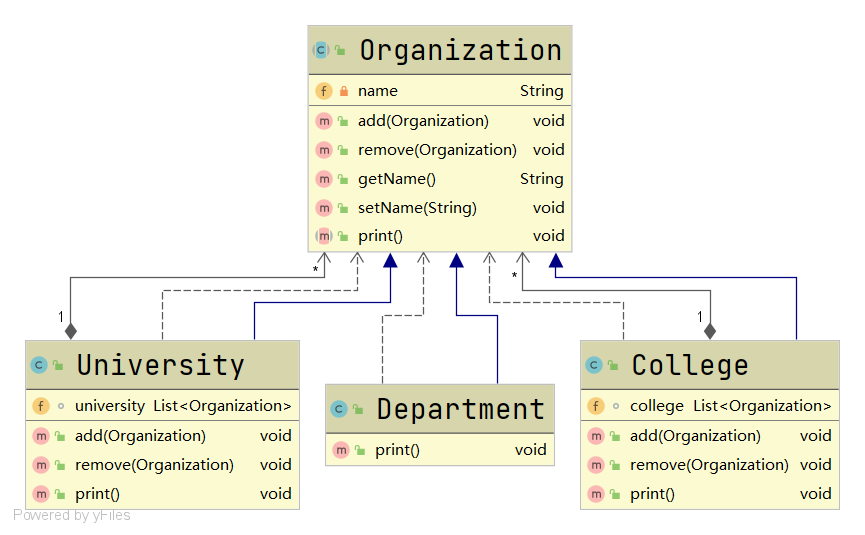

# 组合模式

#### 定义

>又叫部分整体模式，它依据树形结构来组合对象，用来表示部分以及整体层次。

#### 原理

>Component：组合模式中对象的声明接口或者抽象类，默认情况下实现所有类共有接口的默认行为，并且用来访问和管理子部件。

>Composite：非叶子节点，用于存储子部件，实现Component中对子部件的相关操作。

>Leaf：叶子节点，无子节点，不能操作孩子

#### 使用场景

>用于解决要处理的对象能生成一棵树形结构

#### 例子

>一个学校可能有多个学院，一个学院可能有多个系，假设系是一个学校内的最低级组织，现在要求在一个页面中展示学校内的所有组织，如何编程实现？

#### 传统方式

>传统方式下我们可能把学校、学院和系设计成继承关系，这样是站在组织大小的角度上划分的。但是这样不能很好的实现管理操作，比如对一个学校增加学院。

#### 改进

###### UML类图



###### [代码](../../../../../src/main/java/org/fade/pattern/sp/composite)

* ###### Organization.java

```java
public abstract class Organization {

    /**
     * 组织名
     * */
    private String name;

    /**
     * 添加组织
     * @param organization 组织
     * */
    public void add(Organization organization){
        //默认实现
        throw new UnsupportedOperationException();
    }

    /**
     * 移除组织
     * @param organization 组织
     * */
    public void remove(Organization organization){
        //默认实现
        throw new UnsupportedOperationException();
    }

    /**
     * Constructor of Organization
     * @param name 组织名
     * */
    public Organization(String name) {
        this.name = name;
    }

    /**
     * 获得组织名
     * @return 组织名
     * */
    public String getName() {
        return name;
    }

    /**
     * 设置组织名
     * @param name 组织名
     * */
    public void setName(String name) {
        this.name = name;
    }

    /**
     * 打印组织信息
     * */
    public abstract void print();

}
```

* ###### University.java

```java
public class University extends Organization {

    /**
     * 大学里的下属组织
     * */
    List<Organization> university;

    /**
     * Constructor of University
     * @param name 大学名
     * */
    public University(String name){
        super(name);
        this.university = new LinkedList<>();
    }

    /**
     * 添加下属组织
     * @param organization 下属组织
     * */
    @Override
    public void add(Organization organization) {
        this.university.add(organization);
    }

    /**
     * 移除下属组织
     * @param organization 下属组织
     * */
    @Override
    public void remove(Organization organization) {
        this.university.remove(organization);
    }

    /**
     * 打印组织信息
     */
    @Override
    public void print() {
        System.out.println("--------------------"+super.getName()+"--------------------");
        for (Organization organization:university
             ) {
            organization.print();
        }
    }

}
```

* ###### College.java

```java
public class College extends Organization{

    /**
     * 学院里的下属组织
     * */
    List<Organization> college;

    /**
     * Constructor of College
     * @param name 学院名
     * */
    public College(String name){
        super(name);
        this.college = new LinkedList<>();
    }

    /**
     * 添加下属组织
     * @param organization 下属组织
     * */
    @Override
    public void add(Organization organization) {
        this.college.add(organization);
    }

    /**
     * 移除下属组织
     * @param organization 下属组织
     * */
    @Override
    public void remove(Organization organization) {
        this.college.remove(organization);
    }

    /**
     * 打印组织信息
     */
    @Override
    public void print() {
        System.out.println("--------------------"+super.getName()+"--------------------");
        for (Organization organization:college
        ) {
            organization.print();
        }
    }

}
```

* ###### Department.java

```java
public class Department extends Organization {

    /**
     * Constructor of Department
     * @param name 系名
     * */
    public Department(String name){
        super(name);
    }

    /**
     * 打印组织信息
     */
    @Override
    public void print() {
        System.out.println(super.getName());
    }

}
```

* ###### Client.java

```java
public class Client {

    public static void main(String[] args) {
        Organization ncu = new University("ncu");
        Organization information = new College("信息工程学院");
        Organization science = new College("理学院");
        Organization computer = new Department("计算机科学与技术系");
        Organization auto = new Department("自动化系");
        Organization electronics = new Department("电子系");
        Organization physics = new Department("物理系");
        Organization math = new Department("数学系");
        ncu.add(information);
        ncu.add(science);
        information.add(computer);
        information.add(auto);
        information.add(electronics);
        science.add(physics);
        science.add(math);
        ncu.print();
    }

}
```

###### 运行结果

```
--------------------ncu--------------------
--------------------信息工程学院--------------------
计算机科学与技术系
自动化系
电子系
--------------------理学院--------------------
物理系
数学系
```

###### 分析

>可以看到使用组合模式设计程序后，对节点的管理操作明显自由多了


