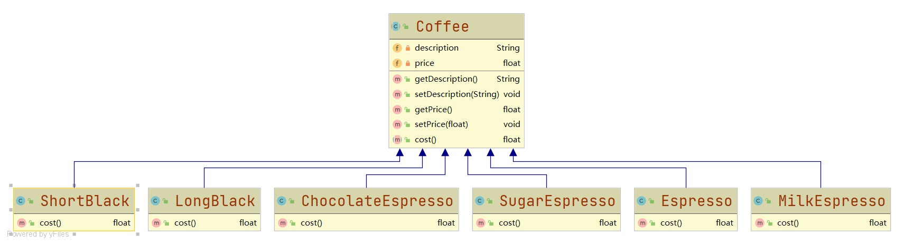
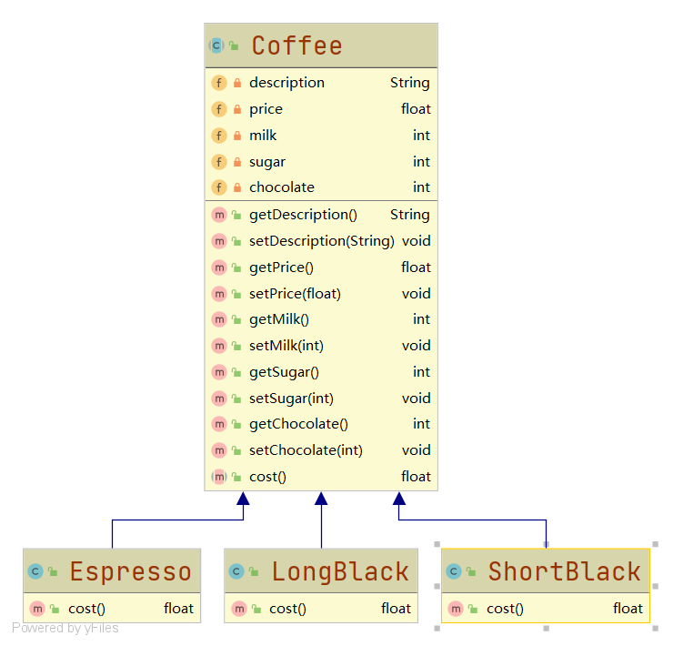
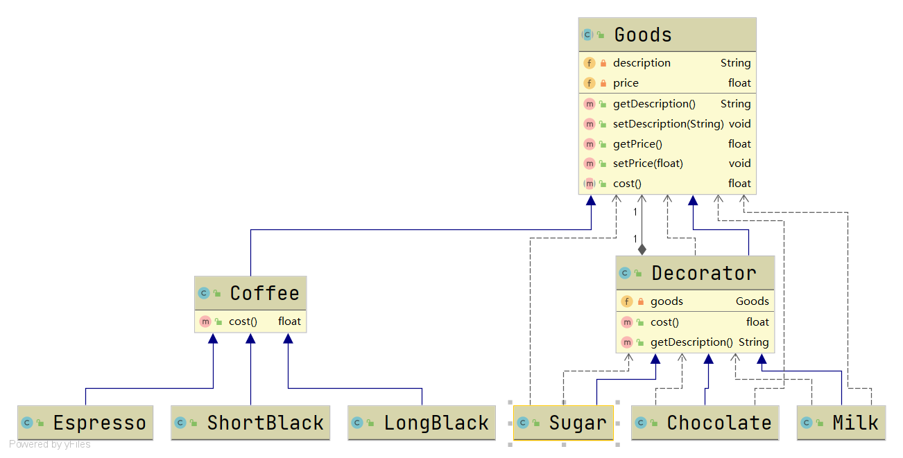
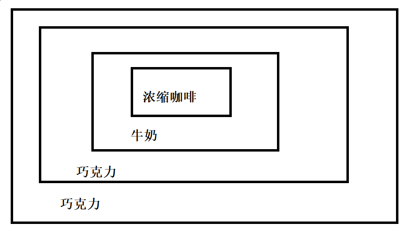
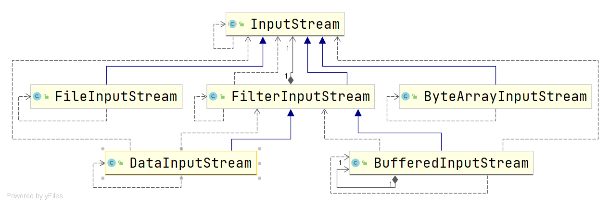
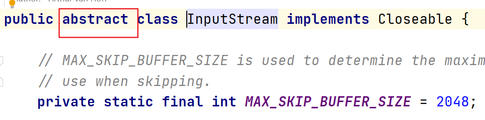
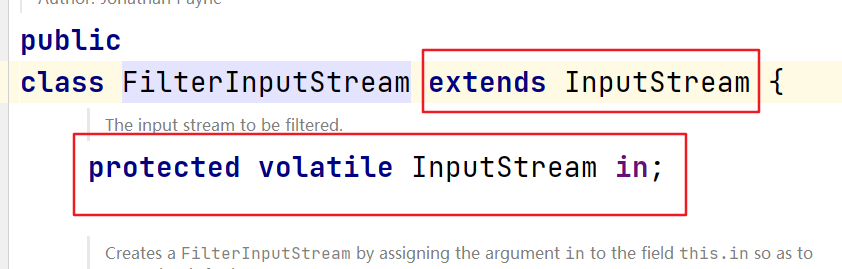

# 装饰器模式

#### 定义

>装饰器模式允许动态的将新功能添加到现有对象，同时又不改变其结构。

#### 原理

>定义一个抽象的主体（Component），修饰者（Decorator）继承和关联抽象的主体

#### 例子

###### 描述

>咖啡有很多种类，比如有Espresso（浓缩咖啡）、LongBlack（长咖啡）、ShortBlack（短咖啡），但是喝咖啡可以只喝单品咖啡，即不放任何配料；也可以放糖、牛奶和巧克力之类的配料。那么如何编程实现？

>这个问题需要注意的是，这里的单品咖啡和放了配料的咖啡之间的关系并不像父子关系。

###### 较差的实现方案

* ###### UML类图



* ###### [代码](../../../../../src/main/java/org/fade/pattern/sp/decorator/example/bad)

>由于代码过多这里就不再展示代码

* ###### 分析

>这里由UML类图知，咖啡和配料之间的关系是全排列的，如果当咖啡和配料的种类一旦多起来，是很容易发生类爆炸的现象的

###### 较好的实现方案

* ###### UML类图



* ###### [代码](../../../../../src/main/java/org/fade/pattern/sp/decorator/example/good)

>由于代码过多这里就不再展示代码

* ###### 分析

>这里把调料内置到咖啡里，这样增加咖啡种类时，不会出现类爆炸的现象。但是一旦配料的种类增加，还是要修改Coffee类的代码，并且当增加的种类很多时，代码的维护量也很大。相比前面那种方案来说，维护性已经算比较好了。

#### 改进

###### UML类图



###### [代码](../../../../../src/main/java/org/fade/pattern/sp/decorator/improve)

>由于代码过多这里就不再展示代码

###### 分析

>这里如若需要增加咖啡种类和调料种类，便不像前面两种方案一样，在功能扩展方面更有弹性。

>并且当下订单时，如果出现下面的订单：2份巧克力+1份牛奶+浓缩咖啡

>只需在浓缩咖啡对象外面一层层用配料包裹住即可，即动态的向对象添加功能，形象的可以理解为：



#### 在JDK中的应用实例

* ###### java.io



>图中的FilterInputStream就相当于Decorator，而InputStream就相当于抽象Component



>InputStream是抽象类



>FilterInputStream既继承又关联了InputStream

>也可以发现IO中包装流的使用方法也和前面的改进部分的相似

```java
public class Main {
    public static void main(String[] args) {
        InputStream in = new DataInputStream(new ByteArrayInputStream());
    }
}
```
