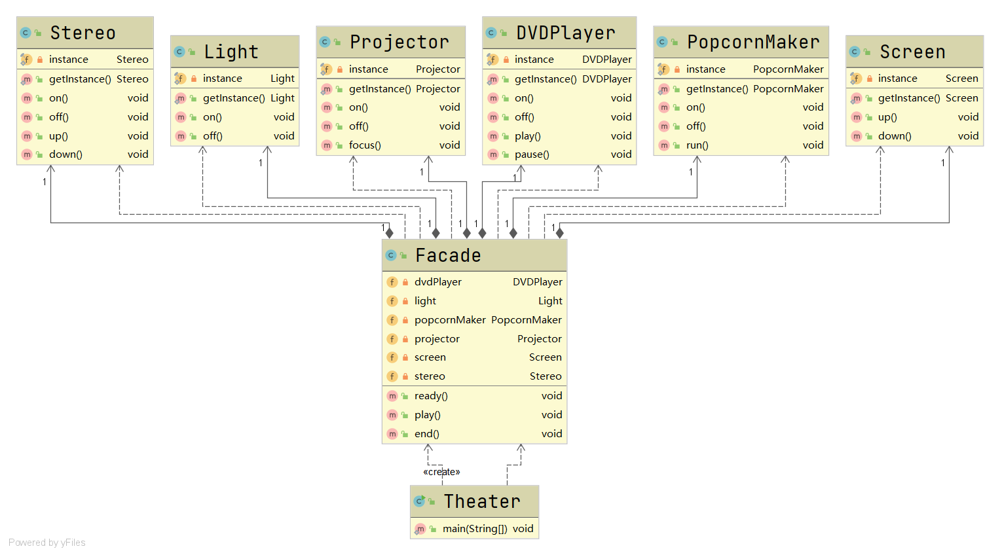

# 外观模式

#### 定义

>即隐藏系统的复杂性，为子系统的一组接口提供一个一致的界面，并向客户端提供一个可以访问系统的高层接口。

#### 原理

>通过外观类为调用者提供统一的调用接口实现，外观类知道如何分配子系统去处理请求，从而将调用者的请求代理给适当的子系统对象。

#### 例子

>组建一个家庭影院，有DVD播放器、灯光、爆米花机、投影仪、屏幕和立体声这几种设备。使用家庭影院的过程要求如下所示：

```
-----------准备工作-----------
DVD player is on
Light is on
Popcorn maker is on
Popcorn maker is running
Projector is on
Screen is going down
Stereo is on
Turn the volume up
-----------正在播放-----------
Light is off
Projector is focusing
DVD player is playing
-----------播放结束-----------
DVD player is off
Light is on
Popcorn maker is off
Projector is off
Screen is rising
Turn the volume down
Stereo is off
```

>问如何编码实现？

#### 传统方式

###### UML类图


###### [代码](../../../../../src/main/java/org/fade/pattern/sp/facade/example)

* ###### 客户端

```java
public class Theater {

    public static void main(String[] args) {
        DVDPlayer dvdPlayer = DVDPlayer.getInstance();
        Light light = Light.getInstance();
        PopcornMaker popcornMaker = PopcornMaker.getInstance();
        Projector projector = Projector.getInstance();
        Screen screen = Screen.getInstance();
        Stereo stereo = Stereo.getInstance();
        System.out.println("-----------准备工作-----------");
        dvdPlayer.on();
        light.on();
        popcornMaker.on();
        popcornMaker.run();
        projector.on();
        screen.down();
        stereo.on();
        stereo.up();
        System.out.println("-----------正在播放-----------");
        light.off();
        projector.focus();
        dvdPlayer.play();
        System.out.println("-----------播放结束-----------");
        dvdPlayer.off();
        light.on();
        popcornMaker.off();
        projector.off();
        screen.up();
        stereo.down();
        stereo.off();
    }

}
```

#### 改进

###### UML类图



###### [代码](../../../../../src/main/java/org/fade/pattern/sp/facade/improve)

* ###### 外观类

```java
public class Facade {

    private DVDPlayer dvdPlayer;

    private Light light;

    private PopcornMaker popcornMaker;

    private Projector projector;

    private Screen screen;

    private Stereo stereo;

    public Facade(){
        this.dvdPlayer = DVDPlayer.getInstance();
        this.light = Light.getInstance();
        this.popcornMaker = PopcornMaker.getInstance();
        this.projector = Projector.getInstance();
        this.screen = Screen.getInstance();
        this.stereo = Stereo.getInstance();
    }

    /**
     * 做好播放的准备工作
     * */
    public void ready(){
        System.out.println("-----------准备工作-----------");
        this.dvdPlayer.on();
        this.light.on();
        this.popcornMaker.on();
        this.popcornMaker.run();
        this.projector.on();
        this.screen.down();
        this.stereo.on();
        this.stereo.up();
    }

    /**
     * 播放
     * */
    public void play(){
        System.out.println("-----------正在播放-----------");
        this.light.off();
        this.projector.focus();
        this.dvdPlayer.play();
    }

    public void end(){
        System.out.println("-----------播放结束-----------");
        this.dvdPlayer.off();
        this.light.on();
        this.popcornMaker.off();
        this.projector.off();
        this.screen.up();
        this.stereo.down();
        this.stereo.off();
    }

}
```

* ###### 客户端

```java
public class Theater {

    public static void main(String[] args) {
        Facade theater = new Facade();
        theater.ready();
        theater.play();
        theater.end();
    }

}
```


