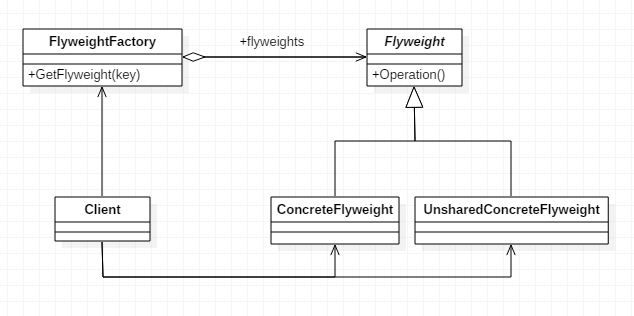

# 享元模式

#### 定义

>又叫蝇量模式，主要用于减少创建对象的数量，当系统中有大量相似对象时，可以使用缓冲池，从缓冲池中取对象。

#### 原理

###### 原理类图



###### 内在状态

>即指对象共享出来的信息，其存储在对象内部且不会随着环境的改变而改变

###### 外部状态

>指对象依赖的一个标记，会随着环境的变化而变化，是不能共享的

###### 叙述

>即享元工厂通过内部状态作为唯一标识符判断内存（缓冲池，如HashMap）中是否存在该标识符所标识的对象，如有则返回该对象，如果没有则创建对象加入到内存中。这样一组内部状态相同的对象就可以用一个对象来代替，再通过改变其外部状态，就可以达到不同的表现效果

#### 使用场景

>常用于系统底层开发，用于解决系统的性能问题，如池技术。例子有：String常量池、数据库连接池和缓冲池等

#### 例子

>一软件公司给客户A做了一个产品展示网站，客户A的朋友在看到A的网站后，感觉效果不错，也希望该软件公司做一个这样的网站给它。事实上，已经有挺多客户都要求该公司做一个这样的网站给它们，只不过要求都有一些不同。有的客户要求网站以新闻的方式发布，有的客户要求以博客的方式发布，还有的客户则要求以微信公众号的形式发布。

>问如何编程实现？

#### 传统方式

>传统方式下可以直接把针对客户A的方案复制粘贴一份，再根据客户的需求进行修改，最后为每个网站在服务器上租用一块空间即可。

>但是这样会造成有很多的实例对象重复，使服务器的资源被浪费掉。

#### 改进

###### UML类图


###### [代码](../../../../../src/main/java/org/fade/pattern/sp/flyweight)

* ###### Website.java

```java
public abstract class Website {

    public abstract void use(String username);

}
```

* ###### ConcreteWebsite.java

```java
public class ConcreteWebsite extends Website {

    private String type;

    public ConcreteWebsite(String type){
        super();
        this.type = type;
    }

    @Override
    public void use(String username) {
        System.out.println("网站的发布类型为："+this.type+"，正在被"+username+"使用着");
    }

}
```

* ###### WebsiteFactory.java

```java
public class WebsiteFactory {

    private Map<String,Website> pool = new HashMap<>();

    public Website getWebsite(String type){
        if(!pool.containsKey(type)){
            pool.put(type,new ConcreteWebsite(type));
        }
        return pool.get(type);
    }

    public int getWebsiteCount(){
        return pool.size();
    }

}
```

* ###### Client.java

```java
public class Client {

    public static void main(String[] args) {
        WebsiteFactory factory = new WebsiteFactory();
        Website news1 = factory.getWebsite("News");
        news1.use("Jack");
        Website blog = factory.getWebsite("Blog");
        blog.use("Tom");
        Website wpa = factory.getWebsite("Wechat Public Account");
        wpa.use("Mike");
        Website news2 = factory.getWebsite("News");
        news2.use("Franklin");
        System.out.println("网站的种类一共有："+factory.getWebsiteCount());
    }

}
```

###### 运行结果

```
网站的发布类型为：News，正在被Jack使用着
网站的发布类型为：Blog，正在被Tom使用着
网站的发布类型为：Wechat Public Account，正在被Mike使用着
网站的发布类型为：News，正在被Franklin使用着
网站的种类一共有：3
```

###### 分析

>这里的用户相当于外部状态，而发布类型相当于内部状态。并且对于同一种发布类型来说，即使使用者不同，它们使用的对象还是同一个。

#### 在JDK中的应用实例

* ###### java.lang.Integer

>查看一段代码：

```java
public class JDK {

    public static void main(String[] args) {
        Integer x = Integer.valueOf(125);
        Integer y = Integer.valueOf(125);
        Integer z = Integer.valueOf(250);
        Integer u = Integer.valueOf(250);
        System.out.println("x的值是否和y相等："+x.equals(y));
        System.out.println("x和y是否指向同一个对象："+(x==y));
        System.out.println("z的值是否和u相等："+z.equals(u));
        System.out.println("z和u是否指向同一个对象："+(z==u));
    }

}
```

>它的运行结果是：

```
x的值是否和y相等：true
x和y是否指向同一个对象：true
z的值是否和u相等：true
z和u是否指向同一个对象：false
```

>按理说x和y应该指向不同的对象，可这里却指向同一个，但是z和u却又不是指向同一个对象。

>查看源码，发现有这么一段代码：


>再点进IntegerCache查看下源码：


>原来调用Integer.valueOf()方法时，如果当参数大于-128小于127时，就会从cache数组中取出Integer对象返回，这里就是享元模式的应用。

#### 优缺点

* ###### 可以减少对象的创建，降低程序内存的使用

* ###### 提高了系统的复杂度，需要区分清楚内部状态是什么、外部状态是什么


