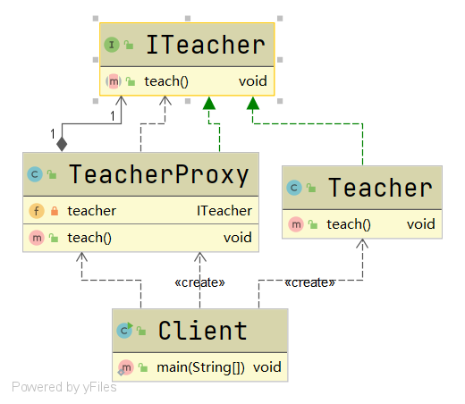
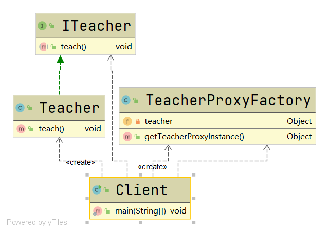
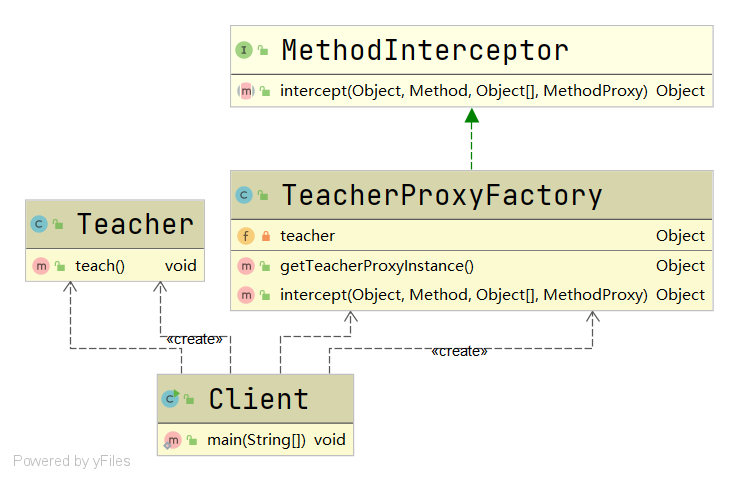

# 代理模式

#### 定义

>为对象提供一个替身，以控制对这个对象的访问，即通过代理对象访问目标对象。

#### 应用场景

>可以代理远程对象、创建开销大的对象和需要安全控制的对象等

#### 分类

###### 静态代理

>需要定义接口或者父类，而代理对象和目标对象都要继承这个父类或者实现这个接口。

###### 动态代理

>代理对象不需要实现接口或者继承父类，而目标对象仍需要实现接口或者继承父类。代理工厂类通过反射的API动态的在内存中构建代理对象。

###### CGLib代理

>代理对象和目标对象都无需继承父类或者实现接口。代理工厂类使用CGLib在内存中构建目标对象的子类对象。

#### 例子

>现在某学校有一个老师生病了，故叫另一个老师代理它上课。

>问如何编程实现？

#### 实现

###### 静态代理

* ###### UML类图



* ###### [代码](../../../../../src/main/java/org/fade/pattern/sp/proxy/staticproxy)

>ITeacher.java

```java
public interface ITeacher {

    void teach();

}
```

>Teacher.java

```java
public class Teacher implements ITeacher{


    @Override
    public void teach() {
        System.out.println("上课......");
    }

}
```

>TeacherProxy.java

```java
public class TeacherProxy implements ITeacher {

    private ITeacher teacher;

    public TeacherProxy(ITeacher teacher){
        this.teacher = teacher;
    }

    @Override
    public void teach() {
        System.out.println("静态代理开始......");
        teacher.teach();
        System.out.println("静态代理结束......");
    }

}
```

>Client.java

```java
public class Client {

    public static void main(String[] args) {
        TeacherProxy teacherProxy = new TeacherProxy(new Teacher());
        teacherProxy.teach();
    }

}
```

* ###### 运行结果

```
静态代理开始......
上课......
静态代理结束......
```

###### 动态代理

* ###### UML类图



* ###### [代码](../../../../../src/main/java/org/fade/pattern/sp/proxy/dynamicproxy)

>TeacherProxyFactory.java

```java
public class TeacherProxyFactory {

    private Object teacher;

    public TeacherProxyFactory(Object teacher){
        this.teacher = teacher;
    }

    public Object getTeacherProxyInstance(){
        return Proxy.newProxyInstance(teacher.getClass().getClassLoader(),
                teacher.getClass().getInterfaces(), (proxy, method, args) -> {
                    System.out.println("动态代理开始......");
                    Object returnVal = method.invoke(teacher,args);
                    System.out.println("动态代理结束......");
                    return returnVal;
                });
    }

}
```

>Client.java

```java
public class Client {

    public static void main(String[] args) {
        TeacherProxyFactory factory = new TeacherProxyFactory(new Teacher());
        ITeacher teacher = (ITeacher) factory.getTeacherProxyInstance();
        teacher.teach();
    }

}
```

* ###### 运行结果

```
动态代理开始......
上课......
动态代理结束......
```

###### CGLib代理

* ###### UML类图



* ###### [代码](../../../../../src/main/java/org/fade/pattern/sp/proxy/cglibproxy)

>Teacher.java

```java
public class Teacher {

    public void teach(){
        System.out.println("上课......");
    }

}
```

>TeacherProxyFactory.java

```java
public class TeacherProxyFactory implements MethodInterceptor {

    private Object teacher;

    public TeacherProxyFactory(Object teacher){
        this.teacher = teacher;
    }

    public Object getTeacherProxyInstance(){
        //1.创建工具类
        Enhancer enhancer = new Enhancer();
        //2.设置父类
        enhancer.setSuperclass(teacher.getClass());
        //3.设置回调函数
        enhancer.setCallback(this);
        //4.创建子类对象，即代理对象
        return enhancer.create();
    }

    @Override
    public Object intercept(Object o, Method method, Object[] objects, MethodProxy methodProxy) throws Throwable {
        System.out.println("CGLib代理开始......");
        Object returnVal = method.invoke(teacher,objects);
        System.out.println("CGLib代理结束......");
        return returnVal;
    }

}
```

>Client.java

```java
public class Client {

    public static void main(String[] args) {
        TeacherProxyFactory factory = new TeacherProxyFactory(new Teacher());
        Teacher teacher = (Teacher) factory.getTeacherProxyInstance();
        teacher.teach();
    }

}
```

* ###### 运行结果

```
CGLib代理开始......
上课......
CGLib代理结束......
```

#### 代理模式变体

* ###### 防火墙代理

* ###### 缓存代理

* ###### 远程代理

* ###### 同步代理

#### 优缺点

* ###### 可以在目标对象实现的基础上，增强额外的功能操作，即拓展目标对象的功能。

* ###### 静态代理可以在不修改目标对象的功能前提下，通过代理对象扩展目标对象功能；但是一旦它们实现的接口或者继承的父类增加了方法，目标对象和代理对象都需要维护。


