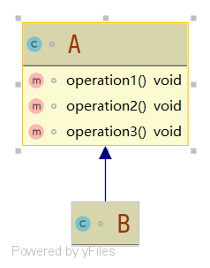
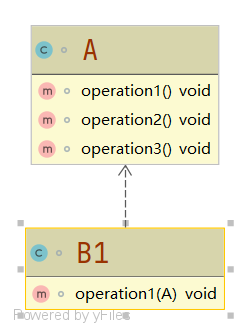
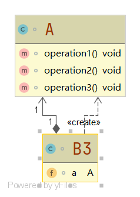

# 合成复用原则

#### 定义

>尽量使用合成/聚合的方式，而不是使用继承

#### 例子



```java
class A{

    void operation1(){

    }

    void operation2(){

    }

    void operation3(){

    }

}

class B extends A{


}
```

>很明显该例子中类B继承了类A，违背了合成复用原则

#### 改进

###### 依赖关系



```java
class B1{

    void operation1(A a){

    }

}
```

###### 聚合方式



```java
class B2{

    A a;

    public void setA(A a) {
        this.a = a;
    }

}
```

###### 组合方式


```java
class B3{

    A a = new A();

}
```

>以上三种方式都没有使用继承关系使用到了A，遵循了合成复用原则

#### 代码

###### [违背合成复用原则](../../../src/main/java/org/fade/principle/crp/CRP.java)

###### 遵循合成复用原则

* ###### [依赖关系](../../../src/main/java/org/fade/principle/crp/CRP1.java)

* ###### [聚合方式](../../../src/main/java/org/fade/principle/crp/CRP2.java)

* ###### [组合方式](../../../src/main/java/org/fade/principle/crp/CRP3.java)

