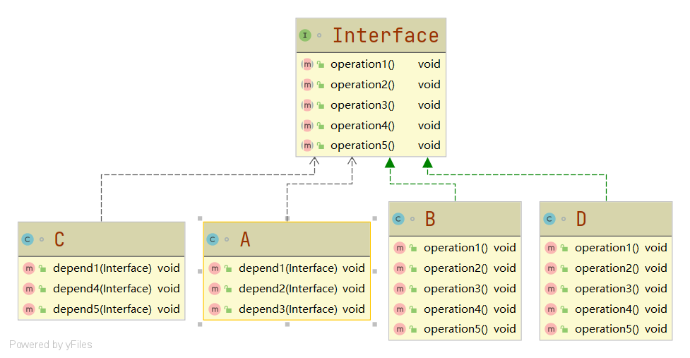
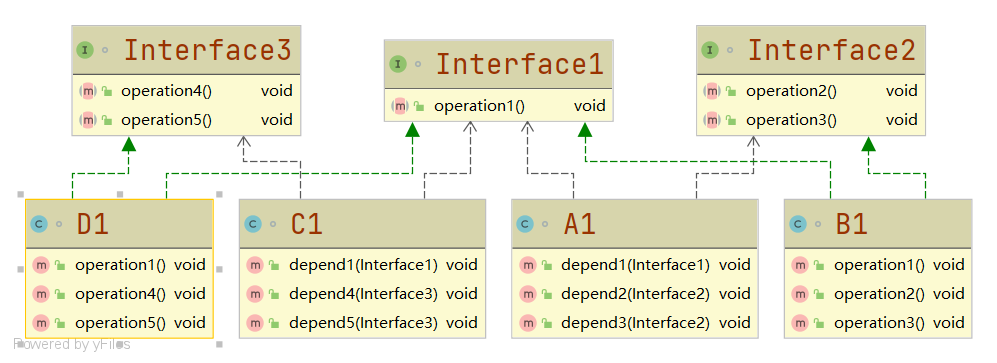

# 接口隔离原则

#### 定义

>客户不应该依赖它不需要的接口，即一个类对另一个类的依赖（使用）应该建立在最小的接口上。

#### 例子

>类A通过接口Interface依赖类B，类C通过接口Interface依赖类D，但是类A只使用了接口的operation1()、operation2()、operation3()方法，类C只使用了接口的operation1()、operation4()、operation5()方法

###### 违反接口隔离原则



>此时由uml类图可以看出，类B的operation4()和operation5()方法是没必要实现的，类D的operation2()和operation3()方法是没必要实现的

```java
interface Interface{

    void operation1();

    void operation2();

    void operation3();

    void operation4();

    void operation5();

}

class B implements Interface{

    @Override
    public void operation1() {
        System.out.println("B implements operation1");
    }

    @Override
    public void operation2() {
        System.out.println("B implements operation2");
    }

    @Override
    public void operation3() {
        System.out.println("B implements operation3");
    }

    @Override
    public void operation4() {
        System.out.println("B implements operation4");
    }

    @Override
    public void operation5() {
        System.out.println("B implements operation5");
    }

}

class D implements Interface{

    @Override
    public void operation1() {
        System.out.println("D implements operation1");
    }

    @Override
    public void operation2() {
        System.out.println("D implements operation2");
    }

    @Override
    public void operation3() {
        System.out.println("D implements operation3");
    }

    @Override
    public void operation4() {
        System.out.println("D implements operation4");
    }

    @Override
    public void operation5() {
        System.out.println("D implements operation5");
    }

}

/**
 * A类通过Interface依赖(引用)B类，但是只会用到operation1()、operation2()、operation3()方法
 * */
class A{

    public void depend1(Interface i){
        i.operation1();
    }

    public void depend2(Interface i){
        i.operation2();
    }

    public void depend3(Interface i){
        i.operation3();
    }

}

/**
 * C类通过Interface依赖(引用)D类，但是只会用到operation1()、operation4()、operation5()方法
 * */
class C{

    public void depend1(Interface i){
        i.operation1();
    }

    public void depend4(Interface i){
        i.operation4();
    }

    public void depend5(Interface i){
        i.operation5();
    }

}
```

###### 未违反接口隔离原则



>从uml图可以看出此时，类B1和类D1都只实现了被A1和C1使用的方法，并没有实现未被使用的方法

```java
interface Interface1{

    void operation1();

}

interface Interface2{

    void operation2();

    void operation3();

}

interface Interface3{

    void operation4();

    void operation5();

}

class B1 implements Interface1,Interface2{

    @Override
    public void operation1() {
        System.out.println("B implements operation1");
    }

    @Override
    public void operation2() {
        System.out.println("B implements operation2");
    }

    @Override
    public void operation3() {
        System.out.println("B implements operation3");
    }

}

class D1 implements Interface1,Interface3{

    @Override
    public void operation1() {
        System.out.println("D implements operation1");
    }

    @Override
    public void operation4() {
        System.out.println("D implements operation4");
    }

    @Override
    public void operation5() {
        System.out.println("D implements operation5");
    }

}

class A1{

    public void depend1(Interface1 i){
        i.operation1();
    }

    public void depend2(Interface2 i){
        i.operation2();
    }

    public void depend3(Interface2 i){
        i.operation3();
    }

}

class C1{

    public void depend1(Interface1 i){
        i.operation1();
    }

    public void depend4(Interface3 i){
        i.operation4();
    }

    public void depend5(Interface3 i){
        i.operation5();
    }

}
```

#### 代码

###### [违反接口隔离原则](../../../src/main/java/org/fade/principle/isp/ISP.java)

###### [遵循接口隔离原则](../../../src/main/java/org/fade/principle/isp/ISP1.java)