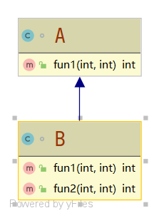
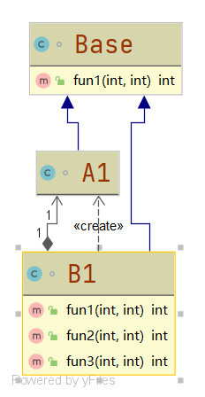

# 里氏替换原则

#### 定义

>所有引用基类的地方必须能够透明地使用其子类，为了遵循里氏替换原则，在子类中尽量不要重写父类的方法

#### 例子

>类A有一个方法fun1()，对传进来的参数a和b作减法a-b；类B继承自类A**无意**中重写了方法fun1()，使fun1()的功能变成了对传进来的参数a和b作减法a+b，但某一时刻，类B却想要使用继承自父类的功能，当它去调用方法fun1()时，此刻便发生了错误



```java
public class LSP {

    public static void main(String[] args){
        A a = new A();
        System.out.println("11-3="+a.fun1(11,3));
        System.out.println("1-8="+a.fun1(1,8));
        System.out.println("***********split***********");
        B b = new B();
        //仍想使用继承自A类的方法，发现已经不行
        System.out.println("11-3="+b.fun1(11,3));
        System.out.println("1-8="+b.fun1(1,8));
        System.out.println("11+3+9="+b.fun2(11,3));
    }

}

class A{
    
    public int fun1(int a,int b){
        return a-b;
    }

}

class B extends A{

    //可能无意识下重写了方法
    @Override
    public int fun1(int a, int b) {
        return a+b;
    }

    public int fun2(int a,int b){
        return this.fun1(a,b) + 9;
    }

}
```

>很明显从上面的代码可以看出仍想使用继承自A类的方法，发现已经不行

#### 改进方法

>我们可以通过聚合、组合和依赖来解决问题，或是把更基础的功能抽象为一个更基础的类



```java
public class LSP1 {

    public static void main(String[] args){
        A1 a = new A1();
        System.out.println("11-3="+a.fun1(11,3));
        System.out.println("1-8="+a.fun1(1,8));
        System.out.println("***********split***********");
        B1 b = new B1();
        //仍可以使用A类方法
        System.out.println("11-3="+b.fun3(11,3));
        System.out.println("1-8="+b.fun3(1,8));
        System.out.println("11+3+9="+b.fun2(11,3));
    }

}

/**
 * 更为基础的基类
 * */
class Base{

    public int fun1(int a,int b){
        return a-b;
    }

}

class A1 extends Base{


}

class B1 extends Base{

    //使用组合关系
    private A1 a = new A1();

    @Override
    public int fun1(int a, int b) {
        return a+b;
    }

    public int fun2(int a,int b){
        return this.fun1(a,b) + 9;
    }

    //如仍需用到A
    public int fun3(int a,int b){
        return this.a.fun1(a,b);
    }

}
```

>上面的代码如果类B仍要用到A就不会发生错误了

#### 代码

###### [违背里氏替换原则](../../../src/main/java/org/fade/principle/lsp/LSP.java)

###### [遵循里氏替换原则](../../../src/main/java/org/fade/principle/lsp/LSP1.java)
