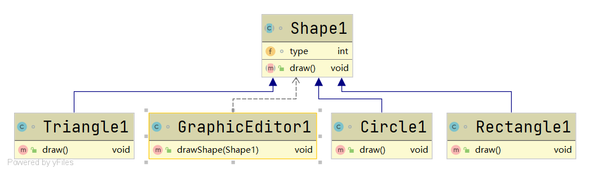

# 开闭原则

#### 定义

>一个软件实体如类，模块和函数**对扩展开放（对提供方来说）**，**对修改关闭（对使用方来说）**。用抽象构建框架，用实现扩展细节。编程中遵循其它原则，以及使用设计模式的目的就是为了遵循开闭原则。

#### 例子

>一个绘制图形的例子，其uml类图如下所示


>提供方代码

```java
class Shape{

    int type;

}

class Rectangle extends Shape{

    Rectangle(){
        super.type = 1;
    }

}

class Circle extends Shape{

    Circle(){
        super.type = 2;
    }

}
```

>使用方代码

```java
class GraphicEditor{

    /**
     * 根据Shape的type值绘制不同的图形
     * */
    public void drawShape(Shape shape){
        if(shape.type==1){
            drawRectangle(shape);
        }
        else if(shape.type==2){
            drawCircle(shape);
        }
    }

    public void drawRectangle(Shape shape){
        System.out.println("绘制矩形");
    }

    public void drawCircle(Shape shape){
        System.out.println("绘制圆形");
    }

}
```

>当需增加一种图形的绘制功能时，此时就必须得在提供方和使用方同时作修改,uml类图如下所示


>由修改前后的uml类图进行对比就可以知道，此时使用方对代码进行了修改，违背了开闭原则

>提供方代码

```java
class Shape{

    int type;

}

class Rectangle extends Shape{

    Rectangle(){
        super.type = 1;
    }

}

class Circle extends Shape{

    Circle(){
        super.type = 2;
    }

}

//新增三角形

class Triangle extends Shape{

    Triangle(){
        super.type = 3;
    }

}
```

>使用方代码

```java
class GraphicEditor{

    /**
     * 根据Shape的type值绘制不同的图形
     * */
    public void drawShape(Shape shape){
        if(shape.type==1){
            drawRectangle(shape);
        }
        else if(shape.type==2){
            drawCircle(shape);
        }
        else{
            //修改部分
            drawTriangle(shape);
        }
    }

    public void drawRectangle(Shape shape){
        System.out.println("绘制矩形");
    }

    public void drawCircle(Shape shape){
        System.out.println("绘制圆形");
    }

    //对使用方的修改开放了，违背了开闭原则
    public void drawTriangle(Shape shape){
        System.out.println("绘制三角形");
    }

}
```

#### 改进

>改进后的uml类图如下所示


>新增三角形时uml类图如下所示



```java
/**
 * 使用方
 * */
class GraphicEditor1{

    public void drawShape(Shape1 shape){
        shape.draw();
    }

}

/**
 * 提供方
 * */
abstract class Shape1{

    int type;

    public abstract void draw();

}

class Rectangle1 extends Shape1{

    Rectangle1(){
        super.type = 1;
    }

    @Override
    public void draw() {
        System.out.println("绘制矩形");
    }

}

class Circle1 extends Shape1{

    Circle1(){
        super.type = 2;
    }

    @Override
    public void draw() {
        System.out.println("绘制圆形");
    }

}

//新增三角形

class Triangle1 extends Shape1{

    Triangle1(){
        super.type = 3;
    }

    @Override
    public void draw() {
        System.out.println("绘制三角形");
    }

}
```

>此时，新增功能时就不需要在使用方进行修改，只需对提供方进行扩展即可，遵循了开闭原则

#### 代码

###### [违背开闭原则](../../../src/main/java/org/fade/principle/ocp/OCP.java)

###### [遵循开闭原则](../../../src/main/java/org/fade/principle/ocp/OCP1.java)