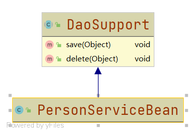
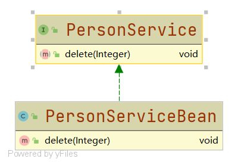

# UML类图

#### 定义

>UML统一建模语言是一种用来建模的语言，而UML类图是UML系统开发中三个主要模型之一对象模型的一种，是用来描述类与类之间的关系的

#### 工具

###### 软件

* ###### [Rational Rose](https://www.ibm.com/support/pages/ibm-rational-rose-enterprise-7004-ifix001)

* ###### ......

###### IDE插件

* ###### [IntelliJ IDEA](tool/IDEA.md)

* ###### [Eclipse](tool/Eclipse.md)

* ###### ......

#### 类与类之间的关系

* ###### 依赖关系

>只要是在类中用到了对方，那么它们之间就存在依赖关系。具体表示为：**是类的成员属性；是方法的返回类型；是方法接收的参数类型；方法中使用到了**。

>代码实例：

```java
public class PersonServiceBean {

    private PersonDao personDao;

    public void save(Person person){

    }

    public IDCard getIDCard(Integer id){
        return null;
    }

    public void modify(){
        Department department = new Department();
    }

}

public class Department {


}

public class Person {


}

public class IDCard {


}

public class PersonDao {


}
```

* ###### 泛化关系

>泛化关系实际上就是继承关系，它是依赖关系的特例

>代码实例：



```java
public abstract class DaoSupport {

    public void save(Object entity){

    }

    public void delete(Object id){

    }

}

public class PersonServiceBean extends DaoSupport{


}
```

* ###### 实现关系

>实现关系实际上就是A类实现B接口，它是依赖关系的特例

>代码实例：



```java
public interface PersonService {

    void delete(Integer id);

}

public class PersonServiceBean implements PersonService {

    @Override
    public void delete(Integer id) {

    }

}
```
