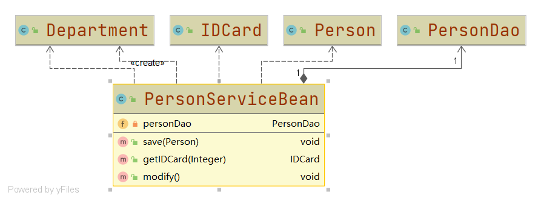
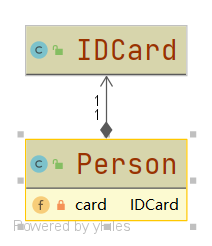
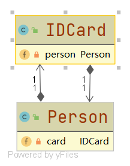
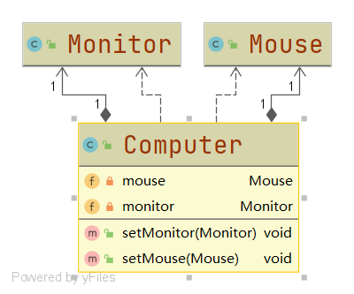
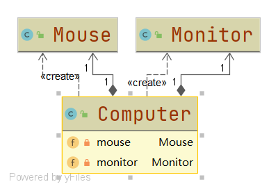

# UML类图

#### 定义

>UML统一建模语言是一种用来建模的语言，而UML类图是UML系统开发中三个主要模型之一对象模型的一种，是用来描述类与类之间的关系的

#### 工具

###### 软件

* ###### [Rational Rose](https://www.ibm.com/support/pages/ibm-rational-rose-enterprise-7004-ifix001)

* ###### ......

###### IDE插件

* ###### [IntelliJ IDEA](tool/IDEA.md)

* ###### [Eclipse](tool/Eclipse.md)

* ###### ......

#### 类与类之间的关系

>[代码地址](../../../src/main/java/org/fade/uml)

* ###### 依赖关系

>只要是在类中用到了对方，那么它们之间就存在依赖关系。具体表示为：**是类的成员属性；是方法的返回类型；是方法接收的参数类型；方法中使用到了**。

>代码实例：



```java
public class PersonServiceBean {

    private PersonDao personDao;

    public void save(Person person){

    }

    public IDCard getIDCard(Integer id){
        return null;
    }

    public void modify(){
        Department department = new Department();
    }

}

public class Department {


}

public class Person {


}

public class IDCard {


}

public class PersonDao {


}
```

* ###### 泛化关系

>泛化关系实际上就是继承关系，它是依赖关系的特例

>代码实例：


```java
public abstract class DaoSupport {

    public void save(Object entity){

    }

    public void delete(Object id){

    }

}

public class PersonServiceBean extends DaoSupport{


}
```

* ###### 实现关系

>实现关系实际上就是A类实现B接口，它是依赖关系的特例

>代码实例：


```java
public interface PersonService {

    void delete(Integer id);

}

public class PersonServiceBean implements PersonService {

    @Override
    public void delete(Integer id) {

    }

}
```

* ###### 关联关系

>关联关系实际上就是类与类之间的联系，它是依赖关系的特例

>关联具有导航性：即双向关系或单向关系

>关联具有多重性：如“0...”(表示0个或者多个)，“1”(表示有且仅有1个)，“0,1”(表示0个或者1个)，“n,m”(表示n个到m个之间)，“m...*”(表示至少m个)

>代码实例：

>单向关联关系



```java
public class Person {

    private IDCard card;

}

public class IDCard {


}
```

>双向关联关系



```java
public class Person {

    private IDCard card;

}

public class IDCard {

    private Person person;

}
```

* ###### 聚合关系

>聚合关系表示的是整体和部分的关系，**整体与部分可以分开**。聚合关系是关联关系的特例，所以它也具有导航性和多重性。

>代码实例：



```java
public class Computer {

    private Mouse mouse;

    private Monitor monitor;

    public void setMonitor(Monitor monitor) {
        this.monitor = monitor;
    }

    public void setMouse(Mouse mouse) {
        this.mouse = mouse;
    }

}

public class Monitor {


}

public class Mouse {


}
```

* ###### 组合关系

>组合关系表示的是整体和部分的关系，**整体与部分不可以分开**。组合关系是关联关系的特例，所以它也具有导航性和多重性。

>代码实例：



```java
public class Computer {

    private Mouse mouse = new Mouse();

    private Monitor monitor = new Monitor();

}

public class Monitor {


}

public class Mouse {


}
```

>上面代码中，当Computer对象创建后，Mouse对象和Monitor对象也被创建了；当Computer对象被销毁后，Mouse对象和Monitor对象也被销毁了；所以这里的Computer对象(整体)和Mouse对象(部分)、Monitor对象(部分)是不能分开的。

* ###### 总结

>泛化关系、实现关系和关联关系是依赖关系的特例，而聚合关系和组合关系是关联关系的特例，所以总的来说不管什么关系都可以称为依赖关系。

>聚合关系是整体和部分可以分开，组合关系是整体和部分不能分开


