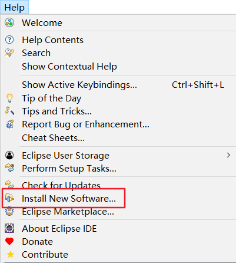
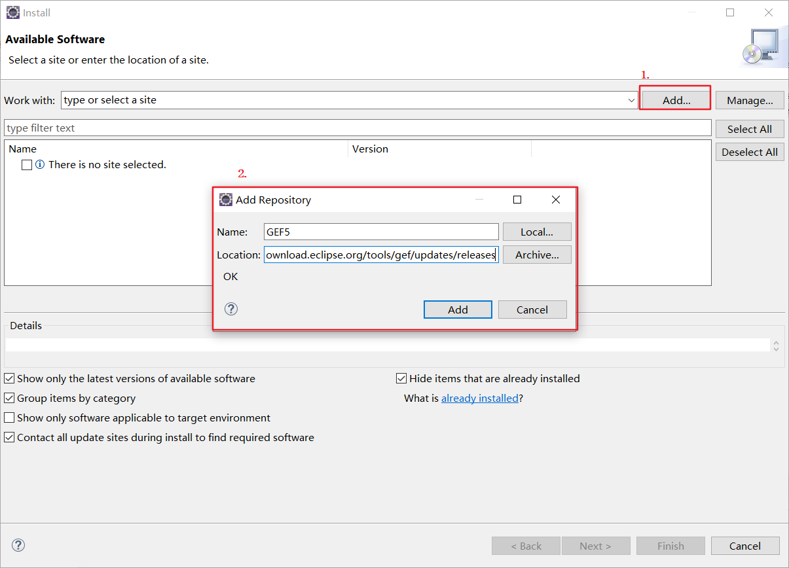
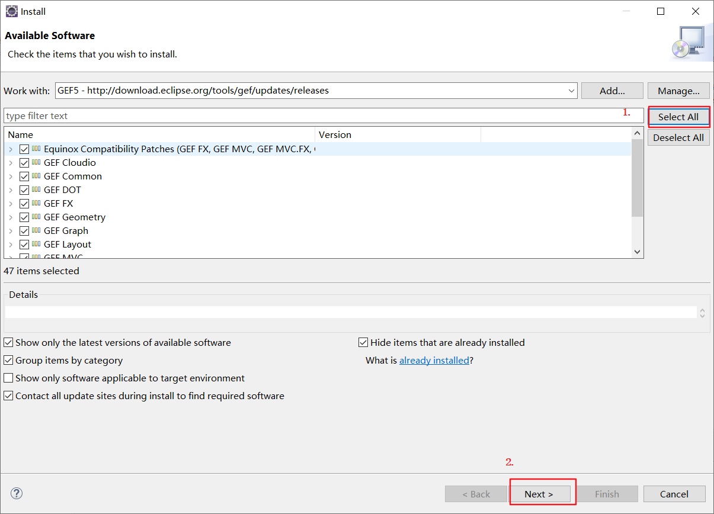
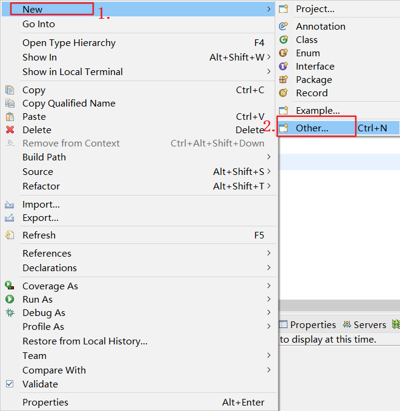
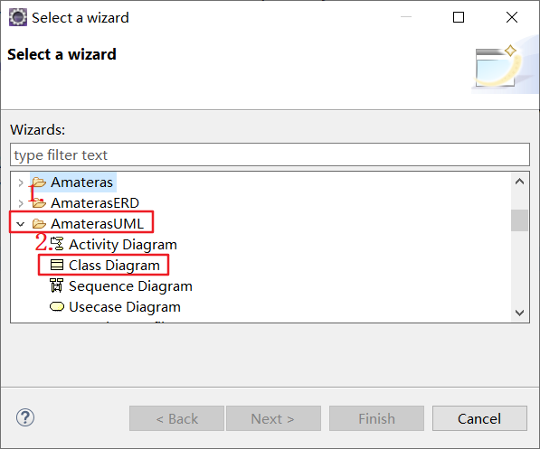
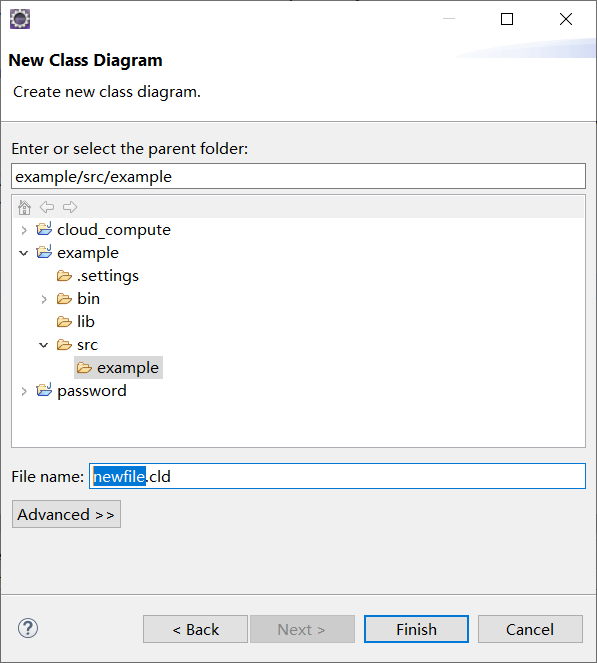
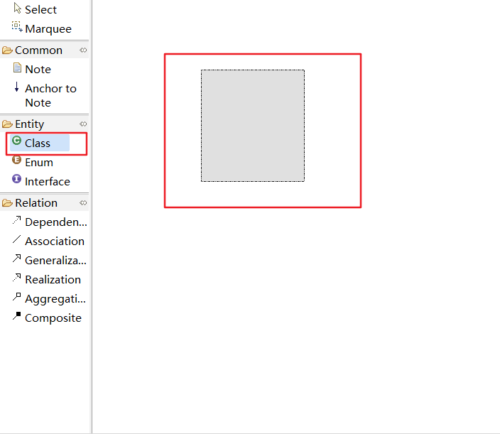
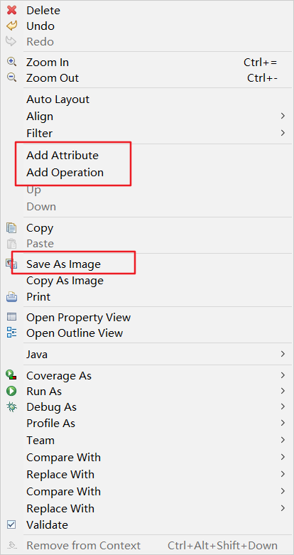

# Eclipse下UML类图绘制

#### Eclipse版本

```
Eclipse IDE for Enterprise Java Developers (includes Incubating components)

Version: 2020-12 (4.18.0)
Build id: 20201210-1552
```

#### AmaterasUML插件

###### 安装教程

>[参考教程](https://www.jianshu.com/p/6239c916fc83)

1. ###### 点击Help->Install New Software...



2. ###### 点击Add...，在弹出窗口输入以下内容

```
Name:GEF5
Location:http://download.eclipse.org/tools/gef/updates/releases
```



3. ###### 点击Add后，点击Select All，再点击Next>



4. ###### 依照提示勾选内容，等待GEF安装完成后重启Eclipse

5. ###### 安装AmaterasUML，具体步骤参考1-4

```
Name:AmaterasUML
Location:https://takezoe.github.io/amateras-update-site/
```

6. ###### 右键选择New->Other...



7. ###### 选择AmaterasUML->Class Diagram



8. ###### 选择存储文件夹及输入文件名



9. ###### 点击右侧Entity里Class/Enum/Interface选项，在右侧拖放出一个矩形




10. ###### 双击可重命名以及右键可添加属性和方法,也可以导出图片




###### 关系图例


