# IntelliJ IDEA下UML类图绘制

#### IDEA版本

```
IntelliJ IDEA 2020.3.2 (Ultimate Edition)
Build #IU-203.7148.57, built on January 26, 2021
```

#### 插件

>IntelliJ IDEA最新非社区版下已集成了绘制UML类图的插件，故不需额外安装

#### 使用

1. ###### 右键选择New->Diagram->Java Class Diagram

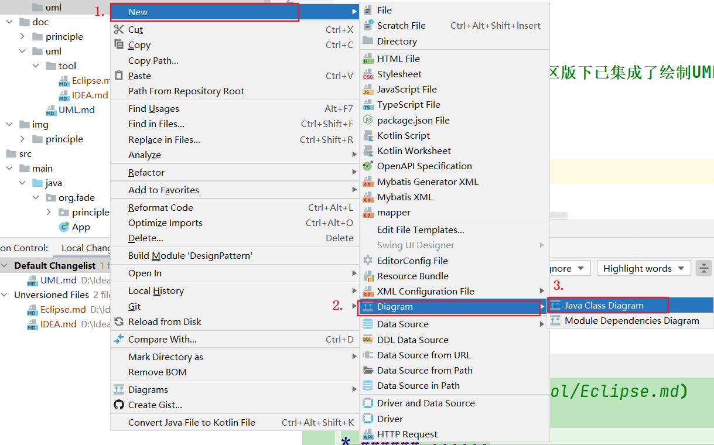

2. ###### 选择保存文件夹及输入文件名

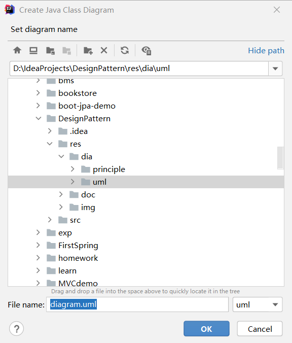

3. ###### 按下空格输入已存在的类名/接口名


4. ###### 右键Show Categories选择展示的内容

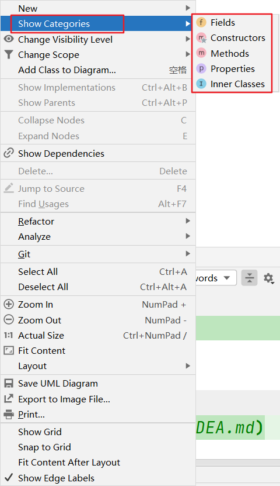

5. ###### 工具栏的各选项作用


6. ###### 或是直接对着某一个包右键Diagrams->Show Diagram...->Java Classes显示当前包下类与类之间的关系

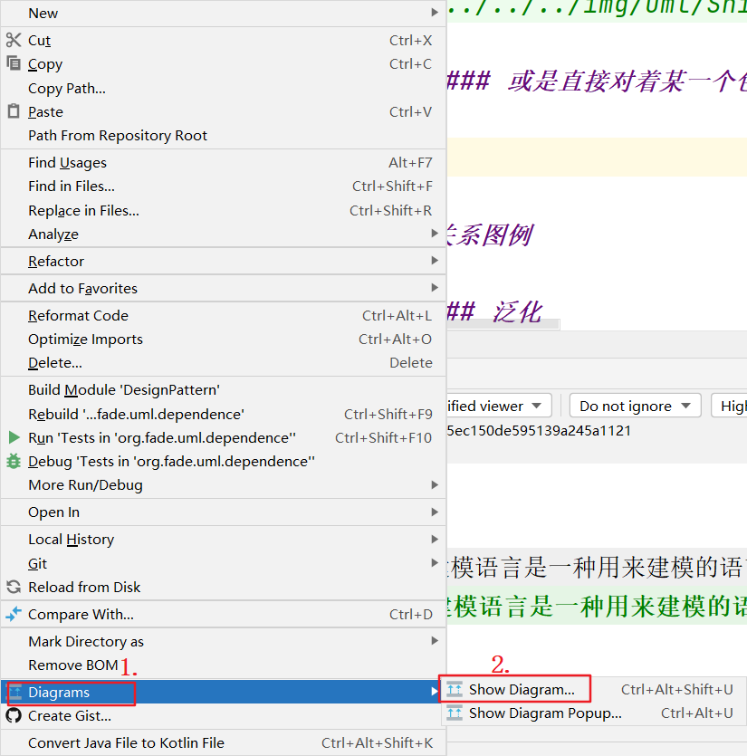


#### 关系图例

* ###### 泛化

>蓝色实线、实心三角箭头，指向父类

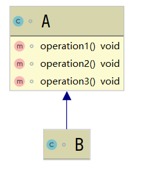

* ###### 实现

>绿色虚线、实心三角箭头，指向接口

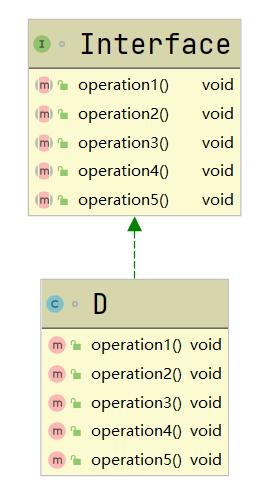

* ###### 依赖

>黑色虚线、非实心三角箭头，指向被调用者

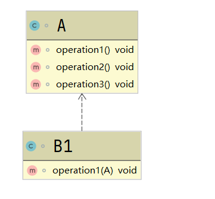

* ###### 关联

>单向关联关系

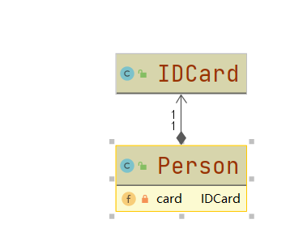

>双向关联关系

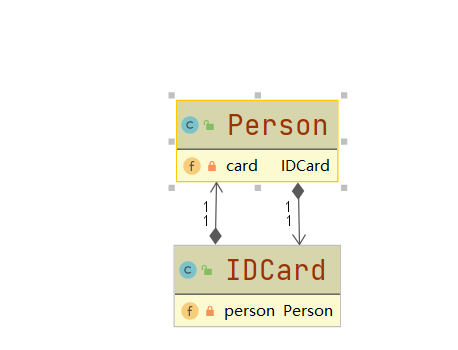

* ###### 聚合

>实线、棱形和虚线，棱形指向整体，箭头指向部分，实线上的数字代表实例的个数

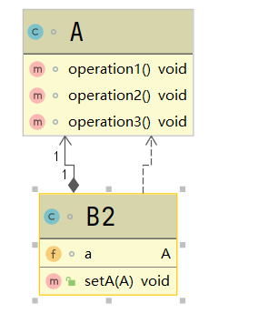

* ###### 组合

>实线、棱形和带有create的虚线，棱形指向整体，箭头指向部分，实线上的数字代表实例的个数

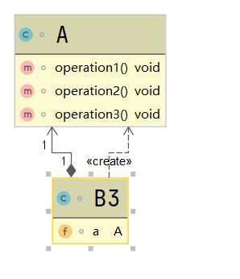

#### 缺点

>目前只支持由已存在的文件中创建类图，不能自由绘制

#### [官方文档](https://www.jetbrains.com/help/idea/class-diagram.html#top)
